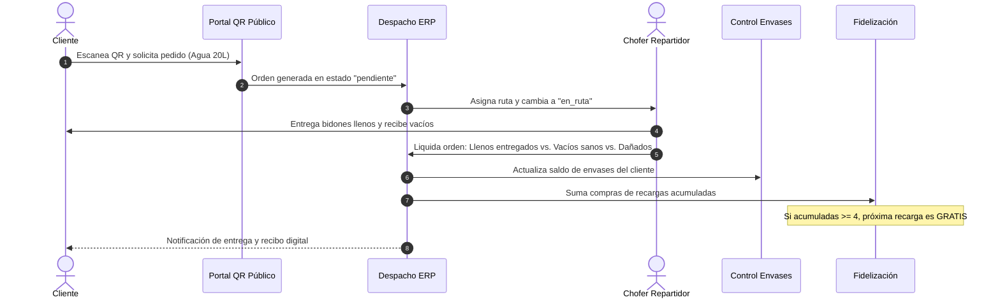

# 💧 Pala-Sed ERP / EasyStock

> **Sistema Integral de Gestión Empresarial, Punto de Venta (POS), Control Logístico de Distribución de Agua, Envases Retornables y Facturación Electrónica SUNAT (UBL 2.1 - Perú).**

[](https://laravel.com)
[](https://php.net)
[](https://www.sunat.gob.pe)
[](https://getbootstrap.com)
[]()

---

## 📌 Tabla de Contenidos
- [1. Descripción del Proyecto](#1-descripción-del-proyecto)
- [2. Características Principales](#2-características-principales)
- [3. Módulos del Sistema](#3-módulos-del-sistema)
- [4. Requisitos del Entorno](#4-requisitos-del-entorno)
- [5. Instalación y Despliegue](#5-instalación-y-despliegue)
- [6. Usuarios y Accesos por Defecto](#6-usuarios-y-accesos-por-defecto)
- [7. Guía de Configuración Tributaria (SUNAT)](#7-guía-de-configuración-tributaria-sunat)
- [8. Ecosistema Especializado de Distribución de Agua](#8-ecosistema-especializado-de-distribución-de-agua)
- [9. Arquitectura y Estructura de Directorios](#9-arquitectura-y-estructura-de-directorios)
- [10. Documentación Detallada (PDR)](#10-documentación-detallada-pdr)

---

## 1. Descripción del Proyecto

**Pala-Sed ERP** (conocido internamente en interfaz como *EasyStock*) es una plataforma integral desarrollada para resolver de extremo a extremo las operaciones de comercializadoras, distribuidoras y embotelladoras de agua de mesa purificada, bebidas y retail. 

Integra en una misma base de código:
1. **Facturación Electrónica Nativa (SUNAT):** Sin dependencias de servicios externos ni costes por comprobante emitido. Genera, firma con certificado digital (`.pfx`/`.pem`), empaqueta en ZIP y transmite vía SOAP UBL 2.1 Facturas, Boletas, Notas de Crédito, Notas de Débito y Guías de Remisión Electrónicas (GRE).
2. **Logística y Reparto a Domicilio:** Gestión de despachos, asignación de choferes repartidores y trazabilidad de entrega en tiempo real.
3. **Control de Envases Retornables (Bidones de 20L):** Control estricto de comodatos y balances de envases en poder del cliente para evitar pérdidas y cobro por reposición de botellones dañados.
4. **Programa de Fidelización (4+1 / 5+1):** Acumulación automática de compras y bonificación configurable de recargas gratuitas para clientes frecuentes.
5. **Autoservicio Omnicanal QR:** Portal web móvil para que los clientes soliciten recargas escaneando un código QR adherido a su bidón, con consulta predictiva y seguimiento de su pedido en vivo.
6. **Multi-Almacén y Kardex:** Control de stock por sucursales físicas, transferencias inter-almacenes y alertas de stock mínimo.

---

## 2. Características Principales

* ⚡ **Punto de Venta (POS) de Alta Velocidad:** Soporte para pistola lectora de código de barras, atajos de teclado, pagos mixtos (Efectivo, Tarjetas, Yape, Plin), ventas a crédito con desglose de cuotas y cálculo automático de vuelto.
* 🧾 **Comprobantes Tributarios y Administrativos:** Emisión simultánea de Facturas (`01`), Boletas (`03`), Notas de Crédito (`07`), Notas de Débito (`08`), Guías de Remisión Remitente (`09`) y Notas de Venta internas (`02`).
* 🖨️ **Impresión Multiformato:** Descarga y previsualización de comprobantes en formato Ticket térmico (80mm / 58mm) y formato oficial A4 con código QR y glosa en letras.
* 📦 **Gestión de Existencias Físicas vs. Servicios:** Atributo de discriminación que impide que servicios intangibles alteren los conteos de inventario físico.
* 🔒 **Seguridad y Roles (RBAC):** Sistema basado en Spatie Permission con 6 roles operativos preconfigurados y protección estricta por middleware.
* 📊 **Reportes Contables SUNAT:** Exportación de Registro de Ventas en formato oficial PLE (PDF y Excel), reporte de documentos emitidos y notas de crédito.

---

## 3. Módulos del Sistema

| Módulo | Descripción | Rutas Principales |
| :--- | :--- | :--- |
| **Principal / Dashboard** | KPIs en tiempo real, gráficas mensuales y métodos de pago. | `/home` |
| **Punto de Venta (POS)** | Facturación en mostrador, escáner de barras, crédito y multimoneda. | `/pos`, `/pos/crear` |
| **Comprobantes SUNAT** | Listado de boletas/facturas, descarga de XML, CDR y despacho manual. | `/billings` |
| **Notas de Crédito y Débito** | Anulaciones y correcciones asociadas a comprobantes de origen. | `/billings/credit-notes`, `/billings/debit-notes` |
| **Notas de Venta** | Documentos administrativos internos con reversión de inventario. | `/salenotes` |
| **Guías de Remisión (GRE)** | Guías electrónicas para transporte público o privado de mercadería. | `/shipment-guides` |
| **Distribución & Reparto** | Despachos de agua, asignación de choferes y franjas horarias. | `/deliveries` |
| **Control de Envases** | Libro mayor de bidones retornables y balance por cliente. | `/jug-movements` |
| **Fidelización** | Promociones automáticas (4+1 / 5+1) y canje de premios. | `/loyalty` |
| **Portal Público QR** | Portal para clientes finales de pedidos express y rastreo en vivo. | `/pedido`, `/pedido/seguimiento/{code}` |
| **Almacenes & Stock** | Existencias por sucursal, ajuste rápido y cambio de establecimiento. | `/warehouses`, `/establishment` |
| **Órdenes de Traslado** | Movimiento de productos entre almacenes con aprobación atómica. | `/transferorders` |
| **Kardex** | Trazabilidad de entradas, salidas y saldos físicos valorizados. | `/kardex` |
| **Compras** | Abastecimiento a proveedores con actualización de costo de compra. | `/buys` |
| **Cotizaciones** | Presupuestos comerciales convertibles a venta con un solo clic. | `/quotes` |
| **Arqueos de Caja** | Apertura, depósitos, retiros, cuadre y cierre diario con ticket. | `/archingcash` |
| **Clientes y Proveedores** | Consulta automática a RENIEC (DNI) y SUNAT (RUC) con Ubigeo. | `/clients`, `/providers` |
| **Reportes Contables** | Registro de ventas oficial (PLE) y reportes de recaudación. | `/billings/reports/*`, `/reportes/*` |
| **Configuración** | Certificado digital, credenciales SOL, empresa, usuarios y roles. | `/business`, `/users`, `/roles` |

---

## 4. Requisitos del Entorno

* **Servidor Web:** Apache 2.4+ o Nginx
* **Lenguaje:** PHP 8.1 o superior
  * Extensiones PHP requeridas: `OpenSSL`, `PDO`, `Mbstring`, `Tokenizer`, `XML`, `Ctype`, `JSON`, `cURL`, `GD` / `Imagick`, `Zip`, `BCMath`, `Soap`.
* **Base de Datos:** MySQL 8.0+ o MariaDB 10.4+
* **Gestor de Paquetes:** Composer 2.x
* **Node.js:** Node 16+ y NPM (para compilación de assets si se modifica Vite)

---

## 5. Instalación y Despliegue

### Paso 1: Clonar el Repositorio
```bash
git clone https://github.com/usuario/pala-sed-erp.git
cd pala-sed-erp
```

### Paso 2: Instalar Dependencias de PHP
```bash
composer install --optimize-autoloader --no-dev
```

### Paso 3: Configuración de Variables de Entorno
Copia el archivo `.env.example` y configura tu conexión de base de datos:
```bash
cp .env.example .env
```

Edita `.env` con tus credenciales:
```env
APP_NAME="Pala-Sed ERP"
APP_ENV=production
APP_DEBUG=false
APP_URL=http://tu-dominio.com

DB_CONNECTION=mysql
DB_HOST=127.0.0.1
DB_PORT=3306
DB_DATABASE=palased_erp
DB_USERNAME=tu_usuario
DB_PASSWORD=tu_password
```

### Paso 4: Generar la Clave de Aplicación y Enlace Simbólico
```bash
php artisan key:generate
php artisan storage:link
```

### Paso 5: Ejecutar Migraciones y Seeders
Este comando creará las 55 tablas, ubigeos completos de Perú, catálogo de documentos SUNAT y los usuarios y datos iniciales de distribución de agua:
```bash
php artisan migrate --seed
```

### Paso 6: Optimizar y Limpiar Caché
```bash
php artisan config:cache
php artisan route:cache
php artisan view:cache
```

---

## 6. Usuarios y Accesos por Defecto

El seeder del sistema genera las siguientes cuentas de prueba:

| Rol | Usuario (`user`) | Contraseña | Almacén Asignado | Permisos Principales |
| :--- | :--- | :--- | :--- | :--- |
| **SUPERADMIN** | `admin` | `admin123$$.` | Principal | Acceso total al sistema y parámetros fiscales |
| **ADMIN** | `testuser` | `Test1234$$.` | Principal | Gestión completa operativa, almacenes y ventas |
| **VENDEDOR** | `ventas` | `ventas123.` | Multi-almacén | POS, cotizaciones, notas de venta, clientes |
| **CAJERO** | `cajero` | `cajero123.` | Principal | Arqueos de caja, cobros y ventas |
| **CONTABILIDAD**| `conta` | `conta123.` | Principal | Reportes contables, comprobantes y registro de ventas |
| **REPARTIDOR** | `repartidor1` | `repartidor123.` | Principal | Recepción y liquidación de pedidos en ruta |

---

## 7. Guía de Configuración Tributaria (SUNAT)

Para emitir comprobantes con validez fiscal en Perú:
1. Inicia sesión con el usuario `admin` y dirígete al menú **Configuración > Empresa** (`/business`).
2. **Datos de Empresa:** RUC (20610316884), Razón Social (`MYTEMS E.I.R.L.`), Nombre Comercial, Dirección Fiscal y Ubigeo.
3. **Certificado Digital:**
   * Carga el archivo tributario `.pfx` o `.pem`.
   * Ingresa la clave privada correspondiente.
4. **Credenciales SOL:**
   * Ingresa el **Usuario Secundario SOL** y su respectiva **Clave SOL** con permisos para emitir comprobantes.
5. **Servidor SUNAT:**
   * Selecciona `Beta / Pruebas` para pruebas de homologación.
   * Selecciona `Producción` para emisión real en línea.
6. **Guías de Remisión (GRE):**
   * Configura el `Client ID` y `Client Secret` generados desde el portal Clave SOL de SUNAT para el envío vía API REST de guías electrónicas.

---

## 8. Ecosistema Especializado de Distribución de Agua



### Conceptos Clave de la Operación de Agua:
* **Fórmula de Saldo de Envases:**
  $$\text{Saldo Nuevo} = \text{Saldo Anterior} + \text{Llenos Entregados} - (\text{Vacíos Sanos} + \text{Dañados Retirados})$$
* **Cobro por Envase Dañado:** Si el cliente retorna un envase roto o en malas condiciones, el chofer registra la incidencia y el sistema añade automáticamente la penalidad económica configurada al cobro final.
* **Fidelización 4+1:** Al acumular 4 recargas de 20 litros, el sistema avisa automáticamente en el POS y en la pantalla móvil del cliente que su siguiente pedido tendrá costo cero en el producto promocionado.
* **Generador de Códigos QR:** En `/deliveries/qr` se generan códigos QR listos para imprimir y pegar en los bidones, permitiendo a los clientes pedir recargas en menos de 30 segundos sin necesidad de descargar aplicaciones móviles.

---

## 9. Arquitectura y Estructura de Directorios

```text
pala-sed-erp/
├── app/
│   ├── Http/Controllers/       # 32 Controladores Web y API
│   │   ├── Api/                # Endpoints externos para SUNAT
│   │   ├── PosController.php   # Punto de Venta y Carrito
│   │   ├── BillingController.php # Comprobantes Electrónicos
│   │   ├── DeliveryController.php # Logística y Reparto de Agua
│   │   ├── JugMovementController.php # Envases retornables
│   │   ├── LoyaltyController.php # Programa de Fidelización
│   │   └── PublicQrOrderController.php # Portal Web QR para clientes
│   ├── Models/                 # 41 Modelos Eloquent
│   └── Services/               # Servicios de Dominio
│       ├── Ebilling/           # Motor nativo UBL 2.1 SUNAT
│       │   ├── Cdr/            # Parseo de constancias de recepción
│       │   ├── Payload/        # Constructores de payload tributario
│       │   ├── Signing/        # Firma digital XMLDSig
│       │   ├── Transport/      # Cliente SOAP WS-Security
│       │   ├── Validation/     # Validaciones previas de comprobantes
│       │   └── Xml/            # Ensamblador UBL 2.1 (Invoice, Notes)
│       └── Water/              # Lógica de distribución de agua
│           ├── JugMovementService.php
│           └── LoyaltyService.php
├── database/
│   ├── migrations/             # 55 migraciones de esquema relacional
│   └── seeders/                # 24 seeders (Ubigeos, roles, usuarios, etc.)
├── docs/
│   ├── PDR.md                  # Documento oficial de Requerimientos y Diseño
│   └── PRD_MODULOS_PENDIENTES_FE.md
├── resources/
│   └── views/
│       ├── admin/              # Vistas administrativas (Blade)
│       │   ├── pos/            # Interfaz POS
│       │   ├── deliveries/     # Despacho y generador QR
│       │   ├── billings/       # Facturación electrónica
│       │   └── layout.blade.php# Layout base SB Admin Pro
│       └── public/             # Vistas de autoservicio móvil
│           ├── order_qr.blade.php
│           └── order_tracking.blade.php
└── routes/
    ├── api.php                 # Rutas de API REST
    └── web.php                 # Rutas web del sistema ERP
```

---

## 10. Documentación Detallada (PDR)

Para consultar la **especificación funcional y lógica exhaustiva**, el diccionario completo de las 55 tablas de base de datos, el detalle de los 41 modelos Eloquent y la matriz completa de más de 80 rutas web y API, revisa el archivo de especificación en:

📄 **[docs/PDR.md](file:///media/gercova/DATA1/PROYECTOS%20WEB/pala-sed-erp/docs/PDR.md)**

---

## 📄 Licencia y Soporte
Sistema desarrollado a medida para **MYTEMS E.I.R.L. / Pala-Sed ERP**. Todos los derechos reservados.
