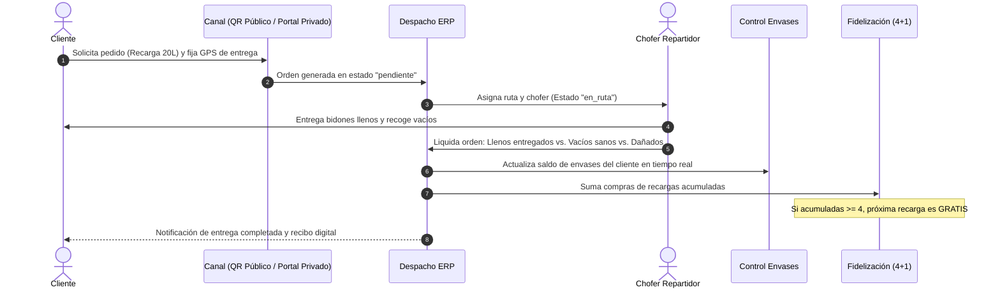

# Pala-Sed ERP / EasyStock

> **Sistema Integral de Gestión Empresarial, Punto de Venta (POS), Control Logístico de Distribución de Agua, Envases Retornables y Facturación Electrónica SUNAT (UBL 2.1 - Perú).**

[](https://laravel.com)
[](https://php.net)
[](https://www.sunat.gob.pe)
[](https://getbootstrap.com)
[]()

---

## Tabla de Contenidos

- [1. Descripción del Proyecto](#1-descripción-del-proyecto)
- [2. Características Principales](#2-características-principales)
- [3. Módulos del Sistema](#3-módulos-del-sistema)
- [4. Requisitos del Entorno](#4-requisitos-del-entorno)
- [5. Instalación y Despliegue](#5-instalación-y-despliegue)
- [6. Usuarios y Accesos por Defecto (7 Roles RBAC)](#6-usuarios-y-accesos-por-defecto-7-roles-rbac)
- [7. Guía de Configuración Tributaria (SUNAT)](#7-guía-de-configuración-tributaria-sunat)
- [8. Ecosistema Especializado de Distribución de Agua](#8-ecosistema-especializado-de-distribución-de-agua)
- [9. Arquitectura y Estructura del Código Fuente](#9-arquitectura-y-estructura-del-código-fuente)
- [10. Documentación Detallada (PDR)](#10-documentación-detallada-pdr)

---

## 1. Descripción del Proyecto

**Pala-Sed ERP** (conocido internamente en la interfaz como *EasyStock*) es una plataforma integral desarrollada para resolver de extremo a extremo las operaciones de comercializadoras, distribuidoras y embotelladoras de agua purificada, bebidas y retail.

Integra en una misma arquitectura nativa:

1. **Facturación Electrónica Nativa (SUNAT):** Sin intermediarios SaaS ni costes recurrentes por comprobante emitido. Genera, valida, firma digitalmente con certificado (`.pfx`/`.pem`), empaqueta en ZIP y transmite vía SOAP UBL 2.1 Facturas (`01`), Boletas (`03`), Notas de Crédito (`07`), Notas de Débito (`08`) y Guías de Remisión Electrónica Remitente (`09`).
2. **Logística y Reparto a Domicilio (Delivery):** Ciclo completo del pedido (`pendiente`, `en_ruta`, `entregado`, `cancelado`), asignación de choferes repartidores y trazabilidad de entrega en tiempo real.
3. **Control de Envases Retornables (Bidones de 20L):** Control estricto de comodatos y balances de botellones en poder del cliente para evitar pérdidas y cobro por reposición de envases dañados.
4. **Programa de Fidelización (4+1 / 5+1):** Acumulación automática de compras de recargas y bonificación configurable de recargas gratuitas para clientes frecuentes.
5. **Autoservicio Omnicanal Dual para Clientes:**
   * **Portal Público QR (`/pedido`):** Acceso sin login mediante escaneo del código QR adherido al bidón de agua, con reconocimiento inteligente por DNI/teléfono y tracking en vivo.
   * **Portal Privado Autenticado (`/cliente`):** Cuenta web de autoservicio con mapa interactivo (Google Maps API) para ubicar coordenadas GPS exactas, historial de compras y panel de fidelización.
6. **Multi-Almacén y Kardex:** Control de stock atomizado por sucursales físicas, transferencias inter-almacenes atómicas, selector de establecimiento en caliente y kardex físico valorizado.

---

## 2. Características Principales

* ⚡ **Punto de Venta (POS) de Alta Velocidad:** Soporte para pistola lectora de código de barras, atajos de teclado, pagos combinados/mixtos (Efectivo, Tarjetas, Yape, Plin), ventas a crédito con desglose de cuotas y cálculo automático de vuelto.
* 🧾 **Comprobantes Tributarios y Administrativos:** Emisión simultánea de Facturas (`01`), Boletas (`03`), Notas de Crédito (`07`), Notas de Débito (`08`), Guías de Remisión Remitente (`09`) y Notas de Venta internas (`02`).
* 🖨️ **Impresión Multiformato:** Descarga y previsualización de comprobantes en formato Ticket térmico (80mm / 58mm) y formato oficial A4 con código QR y glosa legal en letras.
* 📦 **Gestión de Existencias Físicas vs. Servicios:** Atributo de discriminación inmutable (`opcion = 1` físico / `opcion = 2` servicio) que impide que servicios intangibles alteren los conteos de inventario físico.
* 🔒 **Seguridad y Roles (RBAC):** Sistema basado en Spatie Permission con 7 roles operativos preconfigurados y protección estricta por middleware.
* 🛡️ **Protección contra Fuerza Bruta:** Rate limiter en login que bloquea IPs tras 5 intentos fallidos consecutivos.
* 📊 **Reportes Contables Oficiales SUNAT:** Exportación de Registro de Ventas en formato oficial PLE 14.1 (PDF y Excel), reporte de documentos electrónicos emitidos y reporte de notas de crédito.

---

## 3. Módulos del Sistema

| Módulo | Descripción | Rutas Principales |
| :--- | :--- | :--- |
| **Principal / Dashboard** | KPIs en tiempo real, ventas diarias/mensuales, gráficas y medios de pago. | `/home` |
| **Punto de Venta (POS)** | Facturación en mostrador, escáner de barras, crédito, cuotas y multimoneda. | `/pos`, `/pos/crear` |
| **Comprobantes SUNAT** | Panel de facturas/boletas, descarga de XML, CDR y despacho manual a SUNAT. | `/billings` |
| **Notas de Crédito y Débito** | Anulaciones y correcciones asociadas a comprobantes de origen según motivos SUNAT. | `/billings/credit-notes`, `/billings/debit-notes` |
| **Notas de Venta** | Documentos administrativos internos con reversión y reposición atómica de stock. | `/salenotes` |
| **Guías de Remisión (GRE)** | Guías electrónicas (Tipo 09) para transporte público o privado con datos MTC. | `/shipment-guides`, `/shipment-guides/create` |
| **Distribución & Delivery** | Despachos de agua, asignación de choferes, franjas horarias y envío a POS. | `/deliveries` |
| **Control de Envases** | Libro mayor de bidones retornables de 20L y balance dinámico por cliente. | `/jug-movements` |
| **Fidelización (4+1)** | Promociones automáticas para agua, acumulación y canje de bonificaciones. | `/loyalty` |
| **Portal Público QR** | Autoservicio web móvil sin login para pedidos rápidos y rastreo en vivo. | `/pedido`, `/pedido/seguimiento/{code}` |
| **Portal Privado Clientes** | Portal autenticado para clientes con Google Maps API, tracking y dashboard. | `/cliente/dashboard`, `/cliente/pedido/nuevo` |
| **Almacenes & Stock** | Existencias atomizadas por sucursal, ajuste rápido con escáner e importación Excel. | `/warehouses`, `/warehouses/{id}` |
| **Selector de Establecimiento**| Selector dinámico de sucursal activa en sesión sin necesidad de desconectarse. | `/establishment` |
| **Órdenes de Traslado** | Movimiento seguro de mercadería entre sucursales con ejecución transaccional. | `/transferorders`, `/transferorders/create` |
| **Kardex Valorizado** | Trazabilidad de entradas, salidas y saldos físicos valorizados por almacén. | `/kardex` |
| **Compras** | Abastecimiento a proveedores con actualización de costo de adquisición base. | `/buys`, `/buys/create` |
| **Cotizaciones** | Presupuestos comerciales con envío por correo y conversión a venta en un clic. | `/quotes`, `/quotes/create` |
| **Arqueos de Caja** | Apertura, depósitos extraordinarios, retiros, cuadre y cierre diario con ticket. | `/archingcash` |
| **Clientes** | Directorio unificado con consulta automática RENIEC (DNI) y SUNAT (RUC). | `/clients` |
| **Proveedores** | Maestro formal de proveedores fiscales con validación de RUC y ubigeo. | `/providers` |
| **Series y Correlativos** | Configuración de series (`F001`, `B001`, `NV01`, `T001`) asignadas a cajas físicas. | `/series` |
| **Métodos de Pago** | Catálogo de formas de pago: Efectivo, Yape, Plin, Tarjetas y Transferencias. | `/pay-modes` |
| **Reportes Contables** | Registro de ventas oficial (PLE 14.1 en PDF/Excel) y reportes de recaudación. | `/billings/reports/*`, `/reportes/*` |
| **Configuración Fiscal** | Certificado digital (.pfx), credenciales SOL, empresa, usuarios y roles. | `/business`, `/users`, `/roles` |
| **API REST SUNAT** | Endpoints de validación, inspección de payload UBL 2.1 y despacho programático. | `/api/sunat/*` |

---

## 4. Requisitos del Entorno

* **Servidor Web:** Apache 2.4+ o Nginx
* **Lenguaje:** PHP 8.1 o PHP 8.3+ (Recomendado)
  * Extensiones PHP requeridas: `OpenSSL`, `PDO`, `Mbstring`, `Tokenizer`, `XML`, `Ctype`, `JSON`, `cURL`, `GD` / `Imagick`, `Zip`, `BCMath`, `Soap`.
* **Base de Datos:** MySQL 8.0+ o MariaDB 10.4+ (Motor InnoDB)
* **Gestor de Paquetes:** Composer 2.x
* **Node.js:** Node 16+ y NPM (para compilación de assets Vite si se modifican estilos)

---

## 5. Instalación y Despliegue

### Paso 1: Clonar el Repositorio

```bash
git clone https://github.com/usuario/pala-sed-erp.git
cd pala-sed-erp
```

### Paso 2: Instalar Dependencias de PHP

```bash
composer install --optimize-autoloader --no-dev
```

### Paso 3: Configuración de Variables de Entorno

Copia el archivo `.env.example` y configura tu conexión de base de datos:

```bash
cp .env.example .env
```

Edita `.env` con tus credenciales:

```env
APP_NAME="Pala-Sed ERP"
APP_ENV=production
APP_DEBUG=false
APP_URL=http://tu-dominio.com

DB_CONNECTION=mysql
DB_HOST=127.0.0.1
DB_PORT=3306
DB_DATABASE=palased_erp
DB_USERNAME=tu_usuario
DB_PASSWORD=tu_password

# Opcional: Google Maps API para geolocalización en el portal de clientes
GOOGLE_MAPS_API_KEY=tu_api_key_aqui
```

### Paso 4: Generar la Clave de Aplicación y Enlace Simbólico

```bash
php artisan key:generate
php artisan storage:link
```

### Paso 5: Ejecutar Migraciones y Seeders

Este comando creará las 51 tablas relacionales, cargará los 1,874 distritos del Perú (Ubigeos INEI), los catálogos normativos SUNAT, los 7 roles con permisos y los usuarios iniciales:

```bash
php artisan migrate --seed
```

### Paso 6: Optimizar y Limpiar Caché

```bash
php artisan config:cache
php artisan route:cache
php artisan view:cache
```

---

## 6. Usuarios y Accesos por Defecto (7 Roles RBAC)

El seeder del sistema genera las siguientes cuentas de prueba:

| Rol | Usuario (`user`) | Contraseña | Almacén Asignado | Alcance de Permisos |
| :--- | :--- | :--- | :--- | :--- |
| **SUPERADMIN** | `admin` | `admin123$$.` | Principal | Acceso total al sistema, auditoría y parámetros fiscales. |
| **ADMIN** | `testuser` | `Test1234$$.` | Principal | Gestión completa operativa, compras, almacenes y ventas. |
| **VENDEDOR** | `ventas` | `ventas123.` | Multi-almacén | POS, cotizaciones, notas de venta, guías y clientes. |
| **CAJERO** | `cajero` | `cajero123.` | Principal | Arqueos de caja, cobros en mostrador y ventas. |
| **CONTABILIDAD**| `conta` | `conta123.` | Principal | Reportes contables, registro PLE 14.1 y comprobantes. |
| **REPARTIDOR** | `repartidor1` | `repartidor123.`| Principal | Asignación y liquidación de pedidos de agua en ruta. |
| **CLIENTE** | `cliente1` | Auto-registro | — | Portal privado web, nuevos pedidos con GPS y tracking. |

---

## 7. Guía de Configuración Tributaria (SUNAT)

Para emitir comprobantes con validez fiscal en Perú:

1. Inicia sesión con el usuario `admin` y dirígete al menú **Configuración > Empresa** (`/business`).
2. **Datos de Empresa:** RUC (`20610316884`), Razón Social (`MYTEMS E.I.R.L.`), Nombre Comercial, Dirección Fiscal y Ubigeo (Departamento ➔ Provincia ➔ Distrito).
3. **Certificado Digital:**
   * Carga el archivo tributario `.pfx` o `.pem`.
   * Ingresa la contraseña de la clave privada correspondiente.
4. **Credenciales SOL:**
   * Ingresa el **Usuario Secundario SOL** y su respectiva **Clave SOL** con permisos habilitados en SUNAT Operaciones en Línea.
5. **Servidor SUNAT:**
   * Selecciona `Beta / Pruebas` para pruebas de homologación.
   * Selecciona `Producción` para emisión real en línea.
6. **Guías de Remisión (GRE):**
   * Configura el `Client ID` y `Client Secret` generados desde el portal Clave SOL de SUNAT para el envío vía API REST de guías electrónicas.

---

## 8. Ecosistema Especializado de Distribución de Agua


```mermaid
sequenceDiagram
    autonumber
    actor Cliente
    participant Canal as Canal (QR Público / Portal Privado)
    participant Admin as Despacho ERP
    actor Repartidor as Chofer Repartidor
    participant JugService as Control Envases
    participant Loyalty as Fidelización (4+1)

    Cliente->>Canal: Solicita pedido (Recarga 20L) y fija GPS de entrega
    Canal->>Admin: Orden generada en estado "pendiente"
    Admin->>Repartidor: Asigna ruta y chofer (Estado "en_ruta")
    Repartidor->>Cliente: Entrega bidones llenos y recoge vacíos
    Repartidor->>Admin: Liquida orden: Llenos entregados vs. Vacíos sanos vs. Dañados
    Admin->>JugService: Actualiza saldo de envases del cliente en tiempo real
    Admin->>Loyalty: Suma compras de recargas acumuladas
    Note over Loyalty: Si acumuladas >= 4, próxima recarga es GRATIS
    Admin-->>Cliente: Notificación de entrega completada y recibo digital
```

### Conceptos Clave de la Operación de Agua:

* **Fórmula de Saldo de Envases:**
  $$
  \text{Saldo Nuevo} = \text{Saldo Anterior} + \text{Llenos Entregados} - (\text{Vacíos Sanos} + \text{Dañados Retirados})
  $$
* **Cobro por Envase Dañado:** Si el cliente retorna un envase roto o defectuoso, el chofer registra la incidencia y el sistema añade automáticamente la penalidad económica configurada al cobro final.
* **Fidelización 4+1:** Al acumular 4 recargas de 20 litros, el sistema avisa automáticamente en el POS y en la pantalla móvil del cliente que su siguiente pedido tendrá costo cero en el producto promocionado.
* **Portal Privado con Google Maps:** Los clientes autenticados pueden señalar su ubicación exacta arrastrando un marcador en Google Maps, permitiendo a los choferes llegar sin confusiones de nomenclatura urbana.
* **Generador de Códigos QR:** En `/deliveries/qr` se generan códigos QR listos para imprimir y pegar en los bidones, permitiendo a los clientes pedir recargas en segundos sin descargar aplicaciones móviles.

---

## 9. Arquitectura y Estructura del Código Fuente

```text
pala-sed-erp/
├── app/
│   ├── Http/
│   │   ├── Controllers/           # 35 Controladores Web y API
│   │   │   ├── Api/               # Endpoints REST para SUNAT
│   │   │   │   ├── SunatBillingPayloadController.php
│   │   │   │   ├── SunatDispatchController.php
│   │   │   │   └── SunatValidationController.php
│   │   │   ├── Cliente/           # Portal privado autenticado para clientes
│   │   │   │   └── ClientePortalController.php
│   │   │   ├── ArchingCashController.php   # Arqueos, depósitos y retiros
│   │   │   ├── BillingController.php       # Comprobantes y notas de crédito
│   │   │   ├── BillingReportController.php # Registro PLE 14.1 (PDF/Excel)
│   │   │   ├── BuyController.php           # Compras y abastecimiento
│   │   │   ├── DeliveryController.php      # Despacho y reparto de agua
│   │   │   ├── JugMovementController.php   # Control de botellones retornables
│   │   │   ├── LoyaltyController.php       # Fidelización 4+1 / 5+1
│   │   │   ├── PosController.php           # Punto de venta omnicanal
│   │   │   ├── ProviderController.php      # Proveedores fiscales
│   │   │   ├── PublicQrOrderController.php # Portal público QR
│   │   │   ├── ShipmentGuideController.php # Guías de remisión GRE (Tipo 09)
│   │   │   ├── TransferOrderController.php # Traslados entre almacenes
│   │   │   └── WarehouseSelectorController.php # Conmutador de sucursales
│   │   └── Middleware/
│   │       ├── EnsureClienteRole.php       # Aislamiento para portal clientes
│   │       └── EnsureWarehouseSelection.php# Control de sucursal activa
│   ├── Models/                     # 41 Modelos Eloquent
│   └── Services/                   # Lógica de dominio desacoplada
│       ├── Ebilling/               # Motor nativo UBL 2.1 SUNAT
│       │   ├── Cdr/                # Parseo y descompresión de constancias CDR
│       │   ├── Payload/            # Constructores de payload tributario
│       │   ├── Signing/            # Firma digital XMLDSig SHA-1/RSA (.pfx/.pem)
│       │   ├── Transport/          # Cliente SOAP WS-Security con cURL
│       │   ├── Validation/         # Validadores de estructura tributaria
│       │   ├── Xml/                # Ensamblador UBL 2.1 (Invoice, Notes)
│       │   └── SunatDispatchService.php # Orquestador central de despacho
│       └── Water/                  # Servicios especializados de agua
│           ├── JugMovementService.php # Auditoría de envases
│           └── LoyaltyService.php     # Algoritmo de fidelización
├── database/
│   ├── migrations/                 # 45 migraciones de esquema relacional (51 tablas)
│   └── seeders/                    # 25 seeders (Ubigeos INEI, roles, catálogos SUNAT)
├── docs/
│   ├── PDR.md                      # Documento exhaustivo de Especificaciones Lógicas
│   └── PRD_MODULOS_PENDIENTES_FE.md# Certificación de cierre de módulos operativos
├── resources/
│   └── views/
│       ├── admin/                  # 25 módulos de vistas administrativas Blade
│       │   ├── pos/                # Interfaz de Punto de Venta
│       │   ├── deliveries/         # Logística, despachos y generador QR
│       │   ├── billings/           # Facturación electrónica y notas
│       │   ├── arching_cashes/     # Cajas y arqueos
│       │   ├── buys/               # Compras
│       │   ├── providers/          # Proveedores
│       │   └── layout.blade.php    # Layout maestro SB Admin Pro
│       ├── cliente/                # 4 vistas de portal privado cliente
│       │   ├── dashboard.blade.php # Dashboard de cliente
│       │   ├── order.blade.php     # Nuevo pedido con Google Maps
│       │   ├── tracking.blade.php  # Seguimiento en vivo
│       │   └── layout.blade.php    # Layout responsive para clientes
│       ├── public/                 # 2 vistas de autoservicio QR público
│       │   ├── order_qr.blade.php
│       │   └── order_tracking.blade.php
│       ├── establishment.blade.php # Selector visual de sucursales
│       └── login.blade.php         # Login seguro con rate limiting
└── routes/
    ├── api.php                     # Endpoints API REST para SUNAT
    └── web.php                     # 274 rutas web organizadas del ERP
```

---

## 10. Documentación Detallada (PDR)

Para consultar la **especificación técnica, funcional y lógica exhaustiva**, la descripción completa de las 51 tablas de la base de datos, el detalle de los 41 modelos Eloquent y la matriz completa de las 274 rutas del sistema, consulta el documento oficial de especificación en:

📄 **[docs/PDR.md](file:///media/gercova/DATA1/PROYECTOS%20WEB/pala-sed-erp/docs/PDR.md)**

---

## 📄 Licencia y Soporte

Sistema desarrollado a medida para **MYTEMS E.I.R.L. / Pala-Sed ERP**. Todos los derechos reservados.
