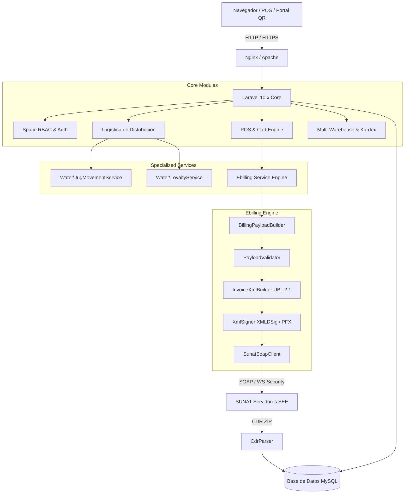

# PDR — Documento de Definición de Producto y Especificaciones Funcionales & Lógicas

**Sistema:** Pala-Sed ERP / EasyStock (Gestión Empresarial, Distribución de Agua & Facturación Electrónica SUNAT)  
**Versión:** 2.0 (Actualizada — Septiembre 2026)  
**Entorno Tecnológico:** PHP 8.1+ / Laravel 10.x / MySQL / Bootstrap 5 / UBL 2.1 SUNAT  
**Emisor Fiscal Principal:** MYTEMS E.I.R.L. (RUC: 20610316884)

---

## 1. Introducción y Visión General del Producto

### 1.1 Propósito y Alcance
**Pala-Sed ERP** (comercialmente presentado en interfaz como *EasyStock*) es una solución integral de planificación de recursos empresariales (ERP), punto de venta (POS), control de inventarios multi-almacén, facturación electrónica nativa bajo la normativa SUNAT (Perú) y un ecosistema especializado para la industria de **purificación, embotellado y distribución logística de agua de mesa**.

El sistema integra todos los eslabones comerciales:
1. **Comercialización & POS:** Atención rápida en mostrador con soporte de código de barras, comprobantes electrónicos (Boletas, Facturas, Notas de Crédito, Notas de Débito) y notas de venta internas.
2. **Logística de Reparto (Delivery):** Despacho a domicilio de bidones de agua, asignación de rutas y conductores con estados en tiempo real (`pendiente`, `en_ruta`, `entregado`, `cancelado`).
3. **Control de Envases Retornables (Bidones/Comodatos):** Trazabilidad física de los botellones de 20L en poder del cliente, reposición por daño y cálculo dinámico de saldo de envases.
4. **Fidelización Automatizada (4+1 / 5+1):** Monitoreo de compras recurrentes de recargas y bonificación automática de productos configurables.
5. **Autoservicio Omnicanal QR:** Portal público para clientes finales accesible mediante escaneo de código QR adherido al bidón de agua, con consulta predictiva de cliente, saldo de envases y tracking del pedido.
6. **Gestión de Almacenes y Compras:** Abastecimiento a proveedores, control de costo promedio, inventario por almacén físico, transferencias inter-sucursales y kardex valorizado.
7. **Facturación Electrónica UBL 2.1:** Generación, firma digital con certificado tributario (.pfx), empaquetado ZIP, envío SOAP a servidores SUNAT y parseo de Constancias de Recepción (CDR) sin intermediarios SaaS de cobro recurrente.

---

## 2. Arquitectura Tecnológica del Sistema



### 2.1 Stack Técnico
* **Backend Framework:** Laravel 10.10+ sobre PHP ^8.1
* **Base de Datos:** MySQL 8.0 / MariaDB 10.4+
* **Motor de Plantillas:** Laravel Blade con maquetación SB Admin Pro y Bootstrap 5
* **Gestión Asíncrona / AJAX:** jQuery 3.6, Vanilla JavaScript, DataTables con procesamiento del lado del servidor (Yajra Datatables Oracle/MySQL)
* **Generación de Documentos:** `barryvdh/laravel-dompdf` (PDFs A4 y formato Ticket 80mm/58mm térmico)
* **Códigos QR:** `simplesoftwareio/simple-qrcode` para representación impresa SUNAT y stickers públicos
* **Manejo Numérico:** `luecano/numero-a-letras` para glosas legales en comprobantes
* **Exportación de Datos:** `maatwebsite/excel` (Reportes contables, Kardex y catálogo de productos)
* **Seguridad y Permisos:** `spatie/laravel-permission` (Control granular de capacidades basado en roles)

---

## 3. Especificaciones de Módulos del Sistema

### 3.1 Módulo 1: Autenticación, Usuarios y Control de Acceso (RBAC)
* **Controladores:** `LoginController`, `UserController`, `RoleController`
* **Modelos:** `User`, `Warehouse`, `Cash`
* **Lógica Funcional:**
  * Acceso mediante usuario (`user`) y contraseña con hash `bcrypt`.
  * Asignación obligatoria a cada usuario de:
    1. Una caja física activa (`idcaja`).
    2. Un almacén activo predeterminado (`idalmacen`).
    3. Uno o más almacenes permitidos mediante la tabla pivote `user_warehouse`.
  * Selector dinámico de sucursal/establecimiento (`WarehouseSelectorController`): permite a usuarios con acceso a múltiples almacenes conmutar su almacén activo durante la sesión sin cerrar sesión.
  * Roles del sistema configurados:
    * `SUPERADMIN`: Control total del sistema, configuración de empresa y auditoría.
    * `ADMIN`: Gestión operativa, compras, inventario, reportes y ventas.
    * `VENDEDOR`: Acceso a POS, cotizaciones, notas de venta y clientes.
    * `CAJERO`: Operación de caja, cobros y arqueos diarios.
    * `CONTABILIDAD`: Reportes contables, registro de ventas SUNAT y comprobantes.
    * `REPARTIDOR`: Asignación de despachos y liquidación de pedidos en ruta.

### 3.2 Módulo 2: Configuración de Empresa y Parámetros Fiscales
* **Controlador:** `BusinessController`
* **Modelo:** `Business`
* **Lógica Funcional:**
  * Administra la información de la empresa emisora: RUC (20610316884), Razón Social (`MYTEMS E.I.R.L.`), Nombre Comercial, logo corporativo, dirección fiscal, código de país (`PE`) y código de Ubigeo INEI (ej. `220501`).
  * Gestión de certificados digitales tributarios: Carga de archivo de certificado `.pfx` o `.pem`, clave privada y visualización de fecha de vencimiento.
  * Parámetros de conexión a SUNAT: Usuario SOL, Clave SOL, selección de ambiente (`BETA` / `PRODUCCION`).
  * Parámetros para Guías de Remisión Electrónica (GRE): `gre_client_id` y `gre_client_secret` para integración con la API REST de SUNAT.
  * Parámetros de mensajería: `instancia_wpp` para integración de envío de tickets por WhatsApp.
  * Parámetros tributarios globales: switch `cobrar_igv` (habilita o deshabilita la afectación de IGV general).

### 3.3 Módulo 3: Cajas y Arqueos de Caja
* **Controladores:** `CashController`, `ArchingCashController`
* **Modelos:** `Cash`, `ArchingCash`, `DetailPayment`
* **Lógica Funcional:**
  * **Cajas Físicas:** Catálogo de cajas (`cashes`) asignables a usuarios y series de emisión.
  * **Apertura de Caja (`arching_cash.save`):** Registro del monto inicial con fecha y hora. La caja pasa a estado `1` (Abierta).
  * **Candado Operativo:** El POS y la emisión de comprobantes exigen que el usuario posea una caja abierta activa en la sesión. De lo contrario, redirige a arqueo.
  * **Movimientos de Efectivo:**
    * `save-deposit`: Registro de ingresos de dinero extraordinarios con detalle y motivo.
    * `save-withdrawal`: Registro de egresos o retiros de dinero de caja con comprobación de saldo.
  * **Cierre de Caja (`admin.close_cash`):**
    * Cuadre de caja automatizado: cruce de datos entre ventas en efectivo, pagos digitales (Yape, Plin, tarjeta), depósitos y retiros.
    * Cálculo de monto esperado versus monto final ingresado por el cajero, calculando discrepancias (faltante o sobrante).
    * Emisión e impresión de ticket de resumen de caja y cierre definitivo (estado `2`).

### 3.4 Módulo 4: Clientes y Proveedores (Entidades Unificadas)
* **Controladores:** `ClientController`, `ProviderController`
* **Modelos:** `Client`, `IdentityDocumentType`, `Department`, `Province`, `District`
* **Lógica Funcional:**
  * Unificación de entidades en tabla `clients` diferenciando tipo de documento: DNI (`1`), RUC (`6`), Pasaporte (`7`), Carnet de Extranjería (`4`), etc.
  * **Consulta Automática:** Integración con servicio de consulta RENIEC / SUNAT (`searchDocument`) para auto-completar razón social, nombres, dirección y ubigeo a partir del número de documento.
  * **Control de Saldo de Envases (`saldo_envases`):** Campo cuantitativo que lleva la cuenta en tiempo real de cuántos bidones de agua vacíos tiene el cliente en su poder.
  * Referencia geográfica: registro de referencias de entrega y coordenadas de GPS para rutas de distribución.

### 3.5 Módulo 5: Catálogo de Productos y Servicios
* **Controlador:** `ProductController`
* **Modelos:** `Product`, `Category`, `Unit`, `IgvTypeAffection`
* **Lógica Funcional:**
  * Clasificación binaria con el atributo `opcion`:
    * `1`: **Producto físico** (sujeto a control de stock, almacenes, inventario y kardex).
    * `2`: **Servicio** (no afecta stock ni genera movimientos de inventario).
  * Código de Barras (EAN-13 / interno) y Código estándar SUNAT (ej. `50202301` para agua purificada).
  * Precios duales: Precio de Compra (costo base) y Precio de Venta.
  * Tributación: Asociación a tipo de afectación al IGV (`10` Gravado, `20` Exonerado, `30` Inafecto, `21` Gratuito).
  * Importación y exportación masiva mediante plantillas Microsoft Excel.

### 3.6 Módulo 6: Gestión Multi-Almacén y Stock
* **Controladores:** `WarehouseController`, `WarehouseSelectorController`
* **Modelos:** `Warehouse`, `StockProduct`, `Product`
* **Lógica Funcional:**
  * Soporte para múltiples sucursales y bodegas físicas (`warehouses`).
  * Stock atomizado por almacén (`stock_products`), permitiendo que un mismo producto tenga costos, precios de venta y existencias distintas según la ubicación.
  * Alertas visuales de stock mínimo en cabecera del sistema.
  * Suma y ajuste rápido de inventario mediante pistola lectora de código de barras (`barcode_sum`).
  * Carga y descarga de inventarios valorizados por almacén en formato Excel.

### 3.7 Módulo 7: Órdenes de Traslado entre Almacenes
* **Controlador:** `TransferOrderController`
* **Modelos:** `TransferOrder`, `DetailTransferOrder`, `StockProduct`
* **Lógica Funcional:**
  * Movimiento seguro de mercadería entre sucursales.
  * Flujo operativo:
    1. Registro de orden seleccionando almacén origen y almacén destino con serie correlativa.
    2. Adición de productos mediante carrito de transferencias con validación de stock disponible en origen.
    3. Aprobación y ejecución del traslado (`move`): Descuenta de forma atómica el stock del almacén origen e incrementa las existencias en el almacén destino.
    4. Anulación de orden (`anulled`): Revierte el movimiento si la orden ya fue ejecutada o cancela la orden pendiente.
    5. Impresión de comprobante de guía de traslado interno en PDF.

### 3.8 Módulo 8: Control de Kardex
* **Controlador:** `KardexController`
* **Lógica Funcional:**
  * Auditoría y trazabilidad cronológica de entradas y salidas de mercadería.
  * Mapea compras (+), ventas (-), transferencias salientes (-), transferencias entrantes (+) y ajustes de inventario.
  * Filtros por sucursal, producto y rango de fechas.

### 3.9 Módulo 9: Compras y Abastecimiento
* **Controlador:** `BuyController`
* **Modelos:** `Buy`, `DetailBuy`, `StockProduct`, `Product`, `Client` (como Proveedor)
* **Lógica Funcional:**
  * Registro de compras con comprobante fiscal (Factura de compra, Boleta, Guía).
  * Selección de almacén de ingreso de la mercadería.
  * Actualización de costo: al registrar la compra, se actualiza el `precio_compra` en `products` y en `stock_products` del almacén receptor.
  * Actualización de inventario: se incrementa automáticamente el `stock_actual` únicamente para ítems de tipo producto (`opcion = 1`).
  * Modalidades de pago: Contado y Crédito.

### 3.10 Módulo 10: Cotizaciones Comerciales
* **Controlador:** `QuoteController`
* **Modelos:** `Quote`, `DetailQuote`, `Product`, `Client`
* **Lógica Funcional:**
  * Elaboración de presupuestos con cálculo de subtotal, IGV y total.
  * Generación de PDF en formato A4 con logo de empresa y condiciones comerciales.
  * Generación de PDF en formato Ticket térmico.
  * Envío directo por correo electrónico al cliente.
  * **Conversión a Venta (`convert_to_sale`):** Permite migrar una cotización aprobada directamente al módulo POS para su facturación inmediata.

### 3.11 Módulo 11: Punto de Venta (POS Omnicanal)
* **Controlador:** `PosController`
* **Modelos:** `Billing`, `SaleNote`, `DetailBilling`, `DetailSaleNote`, `DetailPayment`, `StockProduct`, `Serie`
* **Lógica Funcional:**
  * Carrito de compras en sesión optimizado para alta velocidad.
  * Soporte de lector de código de barras para escaneo continuo y atajos de teclado.
  * Tipos de documento soportados:
    * `01`: Factura Electrónica (requiere cliente con RUC válido de 11 dígitos).
    * `03`: Boleta de Venta Electrónica (DNI o Clientes Varios si es menor a S/ 700.00).
    * `02`: Nota de Venta Interna (documento administrativo sin envío a SUNAT).
  * **Condiciones de Pago:**
    * **Contado:** Pagos mixtos en múltiples medios (`payments`: Efectivo, Yape, Plin, Tarjeta, Transferencia) con desglose en `DetailPayment` y cálculo automático de vuelto.
    * **Crédito:** Planificación de cuotas (`installments`) con montos y fechas de vencimiento obligatorias que cuadran con el total.
  * Descuento global o por producto.
  * **Control de Stock Estricto:** Valida que exista stock suficiente en el almacén activo antes de confirmar la venta; descuenta inventario exclusivamente si `opcion == 1`.
  * **Despacho Inmediato:** En caso de Boleta o Factura, invoca al motor de facturación electrónica para firmar y remitir el comprobante a SUNAT, generando su código QR oficial.

### 3.12 Módulo 12: Facturación Electrónica UBL 2.1 (SUNAT)
* **Controladores:** `BillingController`, `Api\SunatDispatchController`, `Api\SunatBillingPayloadController`, `Api\SunatValidationController`
* **Servicios:** Espacio de nombres `App\Services\Ebilling\*`
* **Componentes del Motor:**
  1. `BillingPayloadBuilder`: Construye la estructura canónica del comprobante basada en estándares OASIS UBL 2.1 y Catálogos SUNAT.
  2. `PayloadValidator`: Valida tipos de documento, longitudes de RUC/DNI, cálculo de bases imponibles, IGV, montos de crédito y cuotas.
  3. `InvoiceXmlBuilder`: Genera el XML UBL 2.1 cumpliendo con la estructura jerárquica: `Invoice`, `CreditNote`, `DebitNote`, namespaces `cac`, `cbc`, `ext`, `ds`.
  4. `XmlSigner`: Firma digitalmente el XML con el certificado digital de la empresa (`.pfx`) aplicando XMLDSig con SHA-1/RSA y digestión canónica C14N.
  5. `SunatSoapClient`: Empaqueta el XML firmado en archivo ZIP y lo envía mediante protocolo SOAP (Envelope WS-Security) al endpoint del SEE-SUNAT con cURL seguro (`cacert.pem`).
  6. `CdrParser`: Descomprime el archivo de Constancia de Recepción `R-{RUC}-{TIPO}-{SERIE}-{CORRELATIVO}.ZIP`, extrae el XML de respuesta y analiza el código de estado (0 = Aceptado, >0 = Rechazado / Observado).
* **Notas de Crédito y Débito:**
  * Emisión de Notas de Crédito referenciando el comprobante de origen, serie modificada y catálogo de motivos SUNAT.
  * Emisión de Notas de Débito por intereses o penalidades.
* **Descargas y Consultas:**
  * Descarga directa del XML firmado (`download_xml`).
  * Descarga directa de la constancia CDR oficial de SUNAT (`download_cdr`).
  * Reintento y reenvío manual de comprobantes pendientes o con error de comunicación (`dispatch`).

### 3.13 Módulo 13: Notas de Venta Internas
* **Controlador:** `SaleNoteController`
* **Modelos:** `SaleNote`, `DetailSaleNote`, `DetailPayment`
* **Lógica Funcional:**
  * Gestión de comprobantes internos de venta para control administrativo.
  * Impresión en ticket térmico y formato PDF A4.
  * Anulación de nota de venta (`anulled`): Restituye el stock físico al almacén y revierte los saldos correspondientes.

### 3.14 Módulo 14: Guías de Remisión Electrónica Remitente (GRE)
* **Controlador:** `ShipmentGuideController`
* **Modelos:** `ShipmentGuide`, `ShipmentGuideItem`, `Business`
* **Lógica Funcional:**
  * Emisión de Guías de Remisión Electrónicas tipo Remitente (Tipo `09`).
  * Registro de motivo de traslado (Venta, Traslado entre establecimientos, etc.).
  * Modalidad de transporte: Transporte Público o Transporte Privado.
  * Datos del transportista o chofer: Nombres, DNI/RUC, número de licencia de conducir, placa vehicular principal y placa secundaria (carreta/remolque).
  * Peso bruto total y unidad de medida (KGM).
  * Puntos de partida y llegada con dirección completa y códigos de Ubigeo de 6 dígitos.
  * Emisión de ticket térmico y formato A4 para fiscalización en ruta.

### 3.15 Módulo 15: Distribución de Agua, Logística y Reparto a Domicilio
* **Controlador:** `DeliveryController`
* **Modelos:** `DeliveryOrder`, `DeliveryOrderItem`, `User`, `Client`
* **Servicios:** `Water\JugMovementService`, `Water\LoyaltyService`
* **Lógica Funcional:**
  * Administra el ciclo de vida del pedido de agua a domicilio:
    * `pendiente`: Pedido ingresado por panel administrativo o autoservicio QR público.
    * `en_ruta`: Asignado a un chofer/repartidor (`User` con rol `REPARTIDOR`).
    * `entregado`: Entrega completada y liquidada en destino.
    * `cancelado`: Cancelación del pedido con motivo documentado.
  * **Programación:** Fecha programada de entrega y franja horaria (`mañana`, `tarde`, `noche`).
  * **Liquidación de Entrega (`complete`):**
    * Registro de cantidad de bidones llenos entregados (`bidones_a_entregar`).
    * Registro de bidones vacíos retornados en buen estado (`bidones_vacios_recibidos`).
    * Registro de bidones rotos o dañados (`bidones_danados_recibidos`).
    * Aplicación de penalidad económica por envases rotos (`cobro_envases_danados`), sumándose al monto total liquidado.
    * Ejecución en una única transacción de base de datos del movimiento de envases y la acumulación de puntos de fidelidad.

### 3.16 Módulo 16: Control de Envases Retornables y Comodatos (Botellones)
* **Controlador:** `JugMovementController`
* **Servicio:** `App\Services\Water\JugMovementService`
* **Modelos:** `JugMovement`, `Client`
* **Lógica Funcional:**
  * Control del inventario de envases en poder del cliente: evita fugas de capital por pérdida de botellones retornables de policarbonato/PET de 20 litros.
  * **Fórmula de Balance de Envases:**
    $$\text{Saldo Nuevo} = \text{Saldo Anterior} + \text{Llenos Entregados} - (\text{Vacíos Intactos} + \text{Vacíos Dañados Retirados})$$
  * Tipos de Movimiento:
    * `entrega_recarga`: Movimiento regular de reparto.
    * `devolucion`: El cliente devuelve envases sin comprar recargas.
    * `venta_envase`: El cliente adquiere en propiedad el envase nuevo.
    * `ajuste`: Corrección manual justificada por auditoría o inventario físico.
  * Historial cronológico por cliente accesible desde su ficha.

### 3.17 Módulo 17: Programa de Fidelización (4+1 / 5+1 Configurable)
* **Controlador:** `LoyaltyController`
* **Servicio:** `App\Services\Water\LoyaltyService`
* **Modelos:** `LoyaltyPromotion`, `ClientLoyalty`, `Client`
* **Lógica Funcional:**
  * Motor de fidelidad para incentivar la compra recurrente de agua.
  * Parámetros de la promoción (`LoyaltyPromotion`):
    * `meta_compras`: Número de compras requeridas (ej. 4 recargas).
    * `bonificacion`: Cantidad de unidades gratuitas a otorgar (ej. 1 recarga gratis).
    * `idproducto_objetivo`: Producto que acumula compras (Recarga 20L).
    * `idproducto_bonificado`: Producto premiado.
  * Acumulación automática: cada vez que se liquida un pedido de delivery o venta con recarga elegible, se incrementa `compras_acumuladas` en `client_loyalty`.
  * Validación de derecho a premio: Si `compras_acumuladas >= meta_compras`, el sistema notifica tanto en POS como en el portal QR: *"¡Tu próxima recarga es GRATIS!"*.
  * Canje (`redeem_reward`): Descuenta la meta del acumulador, preserva excedentes y actualiza `premios_reclamados` con fecha de canje.

### 3.18 Módulo 18: Portal Público de Pedidos por Código QR
* **Controlador:** `PublicQrOrderController`
* **Vistas Públicas:** `resources/views/public/order_qr.blade.php`, `resources/views/public/order_tracking.blade.php`
* **Rutas Públicas:** `/pedido`, `/pedidos-qr`, `/pedido/seguimiento/{code}`
* **Lógica Funcional:**
  * **Generador de QR (`/deliveries/qr`):** Emite etiquetas descargables para pegar en los bidones y publicidad.
  * **Portal Responsive Móvil:**
    * Reconocimiento inteligente de clientes (`check_client`): Al ingresar su teléfono o DNI, si el cliente ya existe, precarga automáticamente su nombre, dirección habitual, referencia y muestra su estado de fidelización actual ("Llevas 3 de 4 compras acumuladas"). Si es nuevo, permite su registro inmediato.
    * Catálogo interactivo de productos de agua, bidones nuevos y dispensadores.
    * Solicitud de cantidad de envases vacíos que el cliente tiene listos para entregar.
    * Selección de franja horaria y método de pago.
    * Generación de código de seguimiento único (ej. `ORD-AB12CD`).
  * **Tracking en Vivo:** Pantalla de seguimiento en tiempo real con línea de tiempo visual del estado del despacho.

### 3.19 Módulo 19: Reportes Financieros y Contables
* **Controladores:** `BillingReportController`, `ReportSalesController`, `ReportPaymentController`
* **Lógica Funcional:**
  * **Registro de Ventas SUNAT (Formato PLE 14.1):**
    * Cumplimiento estricto de columnas contables: Fecha, Tipo Comprobante, Serie, Correlativo, Documento Cliente, Base Gravada, Exonerada, Inafecta, IGV y Total.
    * Exportación a PDF oficial y libro en Microsoft Excel (.xlsx).
  * **Reporte de Documentos Emitidos:** Listado detallado de Boletas y Facturas con estado de envío SUNAT (Aceptado, Rechazado, Pendiente) y enlaces a XML/CDR.
  * **Reporte de Notas de Crédito:** Detalle contable de anulaciones y devoluciones.
  * **Reportes de Ventas Generales:**
    * Ventas por rango de fecha.
    * Ventas agrupadas por producto con cálculo de unidades y montos.
  * **Reporte de Medios de Pago:** Consolidado de recaudación discriminado por Efectivo, Tarjeta, Transferencia, Yape y Plin.

---

## 4. Matriz Completa de Controladores y Rutas

A continuación se detalla el mapa integral de endpoints de la aplicación:

| Método | URI | Nombre de Ruta | Controlador@Método | Middleware / Permiso |
| :--- | :--- | :--- | :--- | :--- |
| **GET** | `/` | `login` | `LoginController@index` | `guest` |
| **POST** | `/login/login` | `login.login` | `LoginController@login` | Web |
| **GET** | `/login/logout` | `login.logout` | `LoginController@logout` | Web |
| **GET** | `/home` | `admin.home` | `HomeController@index` | `auth`, `can:admin.home` |
| **GET** | `/home/ventas-mensuales` | `home.ventas_mensuales` | `HomeController@ventasMensuales` | `auth`, `can:admin.home` |
| **GET** | `/home/reporte-ingresos` | `home.reporte_ingresos` | `HomeController@reporteIngresos` | `auth`, `can:admin.home` |
| **GET** | `/home/metodo-pagos` | `home.metodo_pagos` | `HomeController@metodosPagoVentas` | `auth`, `can:admin.home` |
| **GET** | `/establishment` | `warehouse.selector.index` | `WarehouseSelectorController@index` | `auth` |
| **POST** | `/establishment/select` | `warehouse.selector.store` | `WarehouseSelectorController@store` | `auth` |
| **GET** | `/business` | `admin.business` | `BusinessController@index` | `auth`, `can:admin.business` |
| **POST** | `/business/save-info` | `business.save_info` | `BusinessController@save_info` | `auth`, `can:admin.business` |
| **POST** | `/business/save-sunat` | `business.save_sunat` | `BusinessController@save_sunat` | `auth`, `can:admin.business` |
| **POST** | `/business/load-logo` | `business.load_logo` | `BusinessController@load_logo` | `auth`, `can:admin.business` |
| **POST** | `/business/load-ubigeo` | `admin.load_ubigeo` | `BusinessController@load_ubigeo` | `auth`, `can:admin.business` |
| **GET** | `/cashes` | `admin.cashes` | `CashController@index` | `auth`, `can:admin.cashes` |
| **GET** | `/cashes/get` | `cashes.get` | `CashController@get` | `auth`, `can:admin.cashes` |
| **POST** | `/cashes/save` | `cashes.save` | `CashController@save` | `auth`, `can:admin.cashes` |
| **POST** | `/cashes/store` | `cashes.store` | `CashController@store` | `auth`, `can:admin.cashes` |
| **POST** | `/cashes/delete` | `cashes.delete` | `CashController@delete` | `auth`, `can:admin.cashes` |
| **GET** | `/archingcash` | `admin.arching_cashes` | `ArchingCashController@index` | `auth`, `can:admin.arching_cashes` |
| **GET** | `/archingcash/get` | `arching_cashes.get` | `ArchingCashController@get` | `auth`, `can:admin.arching_cashes` |
| **POST** | `/archingcash/save` | `arching_cash.save` | `ArchingCashController@save` | `auth`, `can:admin.arching_cashes` |
| **POST** | `/archingcash/close` | `admin.close_cash` | `ArchingCashController@close` | `auth`, `can:admin.arching_cashes` |
| **POST** | `/archingcash/save-deposit` | `admin.save_deposit` | `ArchingCashController@save_deposit` | `auth`, `can:admin.arching_cashes` |
| **POST** | `/archingcash/save-withdrawal` | `admin.save_withdrawal` | `ArchingCashController@save_withdrawal` | `auth`, `can:admin.arching_cashes` |
| **POST** | `/archingcash/print-summary` | `admin.print_summary` | `ArchingCashController@print_summary` | `auth`, `can:admin.arching_cashes` |
| **GET** | `/clients` | `admin.clients` | `ClientController@index` | `auth`, `can:admin.clients` |
| **GET** | `/clients/get` | `clients.get` | `ClientController@get` | `auth`, `can:admin.clients` |
| **POST** | `/clients/search-document` | `admin.search_client_document_record`| `ClientController@searchDocument` | `auth`, `can:admin.clients` |
| **POST** | `/clients/save` | `clients.save` | `ClientController@save` | `auth`, `can:admin.clients` |
| **POST** | `/clients/store` | `clients.store` | `ClientController@store` | `auth`, `can:admin.clients` |
| **POST** | `/clients/delete` | `clients.delete` | `ClientController@delete` | `auth`, `can:admin.clients` |
| **GET** | `/providers` | `admin.providers` | `ProviderController@index` | `auth`, `can:admin.providers` |
| **GET** | `/providers/get` | `providers.get` | `ProviderController@get` | `auth`, `can:admin.providers` |
| **POST** | `/providers/search-document`| `admin.search_provider_document_record`| `ProviderController@searchDocument` | `auth`, `can:admin.providers` |
| **POST** | `/providers/save` | `providers.save` | `ProviderController@save` | `auth`, `can:admin.providers` |
| **GET** | `/categories` | `admin.categories` | `CategoryController@index` | `auth`, `can:admin.categories` |
| **GET** | `/products` | `admin.products` | `ProductController@index` | `auth`, `can:admin.products` |
| **GET** | `/products/get` | `products.get` | `ProductController@get` | `auth`, `can:admin.products` |
| **POST** | `/products/save` | `products.save` | `ProductController@save` | `auth`, `can:admin.products` |
| **POST** | `/products/upload-excel` | `products.upload_excel` | `ProductController@upload` | `auth`, `can:admin.products` |
| **GET** | `/products/download-excel` | `products.download_excel` | `ProductController@download` | `auth`, `can:admin.products` |
| **GET** | `/warehouses` | `admin.warehouses` | `WarehouseController@index` | `auth`, `can:admin.warehouses` |
| **GET** | `/warehouses/get` | `warehouses.get` | `WarehouseController@get` | `auth`, `can:admin.warehouses` |
| **GET** | `/warehouses/{id}` | `admin.products_warehouse` | `WarehouseController@products` | `auth`, `can:admin.warehouses` |
| **POST** | `/warehouses/list` | `admin.list_products_warehouse` | `WarehouseController@list_products`| `auth`, `can:admin.warehouses` |
| **POST** | `/warehouses/barcode_sum` | `admin.barcode_sum_product` | `WarehouseController@barcode_sum` | `auth`, `can:admin.warehouses` |
| **GET** | `/warehouses/export-products/{id}`| `admin.export_products_warehouse`| `WarehouseController@export_products`| `auth`, `can:admin.warehouses` |
| **POST** | `/warehouses/upload-excel` | `admin.upload_excel_warehouse` | `WarehouseController@upload_excel_products`| `auth`, `can:admin.warehouses` |
| **GET** | `/transferorders` | `admin.transfer_orders` | `TransferOrderController@index` | `auth`, `can:admin.transfer_orders`|
| **GET** | `/transferorders/create` | `admin.create_transfer_order` | `TransferOrderController@create` | `auth`, `can:admin.transfer_orders`|
| **POST** | `/transferorders/save-transfer`| `admin.save_transfer` | `TransferOrderController@save` | `auth`, `can:admin.transfer_orders`|
| **POST** | `/transferorders/move-transfer`| `admin.move_transfer` | `TransferOrderController@move` | `auth`, `can:admin.transfer_orders`|
| **POST** | `/transferorders/anulled-transfer`| `admin.anulled_tansfer_order`| `TransferOrderController@anulled` | `auth`, `can:admin.transfer_orders`|
| **GET** | `/kardex` | `admin.kardex` | `KardexController@index` | `auth`, `can:admin.products` |
| **GET** | `/quotes` | `admin.quotes` | `QuoteController@index` | `auth`, `can:admin.quotes` |
| **GET** | `/quotes/create` | `admin.create_quote` | `QuoteController@create` | `auth`, `can:admin.quotes` |
| **GET** | `/quotes/q{id}/convert-sale`| `admin.convert_quote_to_sale`| `QuoteController@convert_to_sale` | `auth`, `can:admin.quotes` |
| **POST** | `/quotes/save` | `admin.save_quote` | `QuoteController@save` | `auth`, `can:admin.quotes` |
| **POST** | `/quotes/print-ticket` | `admin.print_quote_ticket` | `QuoteController@print_ticket` | `auth`, `can:admin.quotes` |
| **POST** | `/quotes/print-a4` | `admin.print_quote_a4` | `QuoteController@print_a4` | `auth`, `can:admin.quotes` |
| **GET** | `/pos` | `admin.pos` | `PosController@index` | `auth`, `can:admin.pos` |
| **GET** | `/pos/crear` | `admin.pos.create` | `PosController@create` | `auth`, `can:admin.pos` |
| **GET** | `/pos/get` | `admin.pos.get` | `PosController@get` | `auth`, `can:admin.pos` |
| **POST** | `/pos/search-product` | `admin.search_product_pos` | `PosController@search_product` | `auth`, `can:admin.pos` |
| **POST** | `/pos/load-cart` | `admin.load_cart_pos` | `PosController@load_cart` | `auth`, `can:admin.pos` |
| **POST** | `/pos/add-product` | `admin.add_product_pos` | `PosController@add_product` | `auth`, `can:admin.pos` |
| **POST** | `/pos/add-product-barcode` | `admin.add_product_barcode` | `PosController@add_product_barcode`| `auth`, `can:admin.pos` |
| **POST** | `/pos/save-sale` | `pos.save_sale` | `PosController@save_sale` | `auth`, `can:admin.pos` |
| **GET** | `/salenotes` | `admin.sale_notes` | `SaleNoteController@index` | `auth`, `can:admin.sale_notes` |
| **POST** | `/salenotes/print-ticket` | `admin.print_sale_note` | `SaleNoteController@print_ticket` | `auth`, `can:admin.sale_notes` |
| **POST** | `/salenotes/print-a4` | `admin.print_sale_note_a4` | `SaleNoteController@print_a4` | `auth`, `can:admin.sale_notes` |
| **POST** | `/salenotes/anulled` | `admin.anulled_sale_note` | `SaleNoteController@anulled` | `auth`, `can:admin.sale_notes` |
| **GET** | `/billings` | `admin.billings` | `BillingController@index` | `auth`, `can:admin.billings` |
| **GET** | `/billings/get` | `billings.get` | `BillingController@get` | `auth`, `can:admin.billings` |
| **GET** | `/billings/credit-notes` | `admin.billing_credit_notes` | `BillingController@credit_notes_index`| `auth`, `can:admin.billings` |
| **GET** | `/billings/debit-notes` | `admin.billing_debit_notes` | `BillingController@debit_notes_index`| `auth`, `can:admin.billings` |
| **POST** | `/billings/{id}/credit-note`| `admin.create_credit_note_billing`| `BillingController@create_credit_note`| `auth`, `can:admin.billings` |
| **POST** | `/billings/{id}/debit-note` | `admin.create_debit_note_billing`| `BillingController@create_debit_note` | `auth`, `can:admin.billings` |
| **POST** | `/billings/print-ticket` | `admin.print_billing_ticket` | `BillingController@print_ticket` | `auth`, `can:admin.billings` |
| **POST** | `/billings/print-a4` | `admin.print_billing_a4` | `BillingController@print_a4` | `auth`, `can:admin.billings` |
| **GET** | `/billings/{id}/xml` | `admin.billing_xml` | `BillingController@download_xml` | `auth`, `can:admin.billings` |
| **GET** | `/billings/{id}/cdr` | `admin.billing_cdr` | `BillingController@download_cdr` | `auth`, `can:admin.billings` |
| **POST** | `/billings/{id}/dispatch` | `admin.dispatch_billing` | `BillingController@dispatch` | `auth`, `can:admin.billings` |
| **GET** | `/shipment-guides` | `admin.shipment_guides` | `ShipmentGuideController@index` | `auth`, `can:admin.shipment_guides`|
| **GET** | `/shipment-guides/create` | `admin.create_shipment_guide` | `ShipmentGuideController@create` | `auth`, `can:admin.shipment_guides`|
| **POST** | `/shipment-guides/save` | `admin.save_shipment_guide` | `ShipmentGuideController@save` | `auth`, `can:admin.shipment_guides`|
| **GET** | `/billings/reports/sales-register`| `report.billings.sales_register`| `BillingReportController@salesRegister`| `auth`, `can:report.billings.sales_register`|
| **GET** | `/billings/reports/sales-register/excel`| `report.billings.sales_register.excel`| `BillingReportController@salesRegisterExcel`| `auth` |
| **GET** | `/deliveries` | `admin.deliveries` | `DeliveryController@index` | `auth`, `can:admin.deliveries` |
| **GET** | `/deliveries/get` | `deliveries.get` | `DeliveryController@get` | `auth`, `can:admin.deliveries` |
| **POST** | `/deliveries/store` | `deliveries.store` | `DeliveryController@store` | `auth`, `can:admin.deliveries` |
| **POST** | `/deliveries/assign` | `deliveries.assign` | `DeliveryController@assign_driver` | `auth`, `can:admin.deliveries` |
| **POST** | `/deliveries/complete` | `deliveries.complete` | `DeliveryController@complete` | `auth`, `can:admin.deliveries` |
| **POST** | `/deliveries/cancel` | `deliveries.cancel` | `DeliveryController@cancel` | `auth`, `can:admin.deliveries` |
| **GET** | `/deliveries/qr` | `admin.deliveries.qr` | `DeliveryController@qr_generator` | `auth`, `can:admin.deliveries` |
| **GET** | `/jug-movements` | `admin.jug_movements` | `JugMovementController@index` | `auth`, `can:admin.jug_movements`|
| **GET** | `/jug-movements/get` | `jug_movements.get` | `JugMovementController@get` | `auth`, `can:admin.jug_movements`|
| **POST** | `/jug-movements/store-return`| `jug_movements.store_return`| `JugMovementController@store_return`| `auth`, `can:admin.jug_movements`|
| **POST** | `/jug-movements/adjust-balance`| `jug_movements.adjust_balance`| `JugMovementController@adjust_balance`| `auth`, `can:admin.jug_movements`|
| **GET** | `/loyalty` | `admin.loyalty` | `LoyaltyController@index` | `auth`, `can:admin.loyalty` |
| **GET** | `/loyalty/get-clients` | `loyalty.get_clients` | `LoyaltyController@get_clients` | `auth`, `can:admin.loyalty` |
| **POST** | `/loyalty/save-settings` | `loyalty.save_settings` | `LoyaltyController@save_settings` | `auth`, `can:admin.loyalty` |
| **POST** | `/loyalty/redeem-reward` | `loyalty.redeem_reward` | `LoyaltyController@redeem_reward`| `auth`, `can:admin.loyalty` |
| **GET** | `/pedido` | `public.order.index` | `PublicQrOrderController@index` | Público |
| **POST** | `/pedido/check-client` | `public.order.check_client` | `PublicQrOrderController@check_client`| Público |
| **POST** | `/pedido/store` | `public.order.store` | `PublicQrOrderController@store` | Público |
| **GET** | `/pedido/seguimiento/{code}`| `public.order.tracking` | `PublicQrOrderController@tracking` | Público |
| **GET** | `/buys` | `admin.buys` | `BuyController@index` | `auth`, `can:admin.buys` |
| **GET** | `/buys/create` | `admin.create_buy` | `BuyController@create` | `auth`, `can:admin.buys` |
| **POST** | `/buys/save` | `admin.save_buy` | `BuyController@save` | `auth`, `can:admin.buys` |
| **GET** | `/reportes/ventas` | `report.sales.index` | `ReportSalesController@index` | `auth`, `can:report.sales.index`|
| **GET** | `/reportes/pagos` | `report.payments.index` | `ReportPaymentController@index` | `auth`, `can:report.payments.index`|
| **POST** | `/api/sunat/validate` | — | `Api\SunatValidationController` | API Pública / Externa |
| **GET** | `/api/sunat/billings/{billing}/payload`| — | `Api\SunatBillingPayloadController` | API Pública / Externa |
| **POST** | `/api/sunat/billings/{billing}/dispatch`| — | `Api\SunatDispatchController` | API Pública / Externa |

---

## 5. Diccionario de Datos y Modelo de Entidades

El sistema cuenta con **41 Modelos Eloquent** y **55 migraciones**. A continuación se especifican las tablas y modelos medulares:

### 5.1 `businesses` (`App\Models\Business`)
Configuración institucional de la empresa emisora.
* `id` (BigInt, PK)
* `ruc` (Varchar 11): RUC tributario.
* `razon_social` (Varchar 255): Razón social legal.
* `nombre_comercial` (Varchar 255): Nombre comercial en tickets.
* `logo` (Varchar 255): Nombre de archivo en storage.
* `direccion`, `urbanizacion`, `local` (Varchar 255): Domicilio fiscal.
* `ubigeo` (Varchar 6): Código distrital INEI.
* `codigo_pais` (Varchar 2): Código ISO (`PE`).
* `certificado` (Varchar 255): Ruta del archivo `.pfx` o `.pem`.
* `clave_certificado` (Varchar 255): Clave privada de encriptación del certificado digital.
* `usuario_sunat`, `clave_sunat` (Varchar 100): Credenciales SOL de emisión.
* `servidor_sunat` (Varchar 20): `1` (Beta / Pruebas) o `2` (Producción).
* `gre_client_id`, `gre_client_secret` (Varchar 150): Credenciales API REST para Guías GRE.
* `instancia_wpp` (Varchar 100): Instancia WhatsApp API.
* `cobrar_igv` (Boolean): Toggle tributario general.

### 5.2 `users` (`App\Models\User`)
Cuentas de usuario de acceso al ERP.
* `id` (BigInt, PK)
* `nombres` (Varchar 255)
* `user` (Varchar 100, Unique): Nombre de usuario de login.
* `password` (Varchar 255): Clave encriptada.
* `estado` (TinyInt): 1 = Activo, 0 = Inactivo.
* `idcaja` (BigInt, FK `cashes.id`): Caja física asignada.
* `idalmacen` (BigInt, FK `warehouses.id`): Almacén predeterminado en sesión.

### 5.3 `clients` (`App\Models\Client`)
Directorio unificado de clientes y proveedores.
* `id` (BigInt, PK)
* `iddoc` (BigInt, FK `identity_document_types.id`): Tipo de documento de identidad (1=DNI, 6=RUC).
* `nro_documento` (Varchar 20): Número de documento.
* `nombres` (Varchar 255): Nombres y apellidos o Razón Social.
* `direccion` (Varchar 255): Domicilio o dirección de entrega.
* `referencia` (Varchar 255): Referencia urbana para despachos de agua.
* `coordenadas` (Varchar 100): Coordenadas GPS lat/lng para ruteo.
* `ubigeo` (Varchar 6): Código de 6 dígitos del distrito.
* `telefono` (Varchar 30): Teléfono de contacto / WhatsApp.
* `email` (Varchar 150): Correo electrónico para comprobantes.
* `saldo_envases` (Integer): Cantidad neta de bidones retornables en posesión del cliente.

### 5.4 `products` (`App\Models\Product`)
Maestro de catálogo de productos y servicios.
* `id` (BigInt, PK)
* `codigo_interno` (Varchar 50, Unique): Código SKU propio.
* `codigo_barras` (Varchar 50): Código de barras para escáner.
* `codigo_sunat` (Varchar 20): Código de producto SUNAT (ej. 50202301).
* `descripcion` (Varchar 255): Nombre del producto o servicio.
* `idunidad` (BigInt, FK `units.id`): Unidad de medida (NIU, ZZ, etc.).
* `idcategoria` (BigInt, FK `categories.id`): Categoría comercial.
* `igv` (Decimal 5,2): Porcentaje de impuesto (18.00).
* `idcodigo_igv` (BigInt, FK `igv_type_affections.id`): Código de afectación tributaria (10 Gravado, etc.).
* `precio_compra` (Decimal 12,2): Costo de adquisición base.
* `precio_venta` (Decimal 12,2): Precio de venta sugerido al público.
* `opcion` (TinyInt): `1` = Producto físico (control de stock), `2` = Servicio (sin stock).
* `stock_actual` (Integer): Consolidado global de existencia.

### 5.5 `stock_products` (`App\Models\StockProduct`)
Existencia atomizada por almacén físico.
* `id` (BigInt, PK)
* `idproducto` (BigInt, FK `products.id`)
* `idalmacen` (BigInt, FK `warehouses.id`)
* `stock_minimo` (Integer): Límite para disparar alertas.
* `stock_actual` (Integer): Cantidad disponible en dicho almacén.
* `precio_compra` (Decimal 12,2): Costo en este almacén.
* `precio_venta` (Decimal 12,2): Precio de venta en este almacén.

### 5.6 `billings` (`App\Models\Billing`)
Comprobantes electrónicos oficiales con valor tributario (SUNAT).
* `id` (BigInt, PK)
* `idtipo_comprobante` (BigInt, FK `type_documents.id`): 1 = Factura (01), 2 = Boleta (03), 4 = Nota de Crédito (07), 5 = Nota de Débito (08).
* `serie` (Varchar 4): Ej. `F001`, `B001`, `FC01`, `BC01`.
* `correlativo` (Varchar 8): Ej. `00000001`.
* `fecha_emision` (Date), `fecha_vencimiento` (Date), `hora` (Time).
* `idcliente` (BigInt, FK `clients.id`).
* `idmoneda` (BigInt, FK `currencies.id`): 1 = PEN (Soles).
* `idpago` (BigInt, FK `pay_modes.id`): Método principal.
* `modo_pago` (TinyInt): 1 = Contado, 2 = Crédito.
* `sunat_forma_pago` (Varchar 20): 'Contado' o 'Credito'.
* `gravada`, `exonerada`, `inafecta`, `gratuita`, `igv`, `icbper`, `total` (Decimal 12,2).
* `monto_credito` (Decimal 12,2): Monto financiado si es al crédito.
* `cuotas` (JSON): Desglose de cuotas con fecha de vencimiento y monto.
* `payment_breakdown` (JSON): Detalle de medios de pago en ventas al contado.
* `cdr` (TinyInt): 1 = Aceptado, 0 = Rechazado / Pendiente.
* `estado_cpe` (Varchar 50): Estado de respuesta SUNAT.
* `errores` (Text): Descripción de rechazos u observaciones del CDR / SOAP.
* `anulado` (Boolean): Indica si fue dado de baja o afectado por Nota de Crédito.
* `id_tipo_nota_credito` (BigInt, FK `credit_note_types.id`): Motivo SUNAT si es Nota de Crédito.
* `idfactura_anular` (BigInt, FK `billings.id`): Comprobante de referencia afectado.
* `idarqueocaja` (BigInt, FK `arching_cashes.id`): Vínculo con el arqueo abierto.
* `idalmacen` (BigInt, FK `warehouses.id`): Almacén de donde se descontó el stock.

### 5.7 `sale_notes` (`App\Models\SaleNote`)
Notas de venta comerciales no tributarias.
* `id` (BigInt, PK)
* `serie` (Varchar 4): Ej. `NV01`.
* `correlativo` (Varchar 8).
* `fecha_emision` (Date), `hora` (Time).
* `idcliente` (BigInt, FK `clients.id`).
* `subtotal`, `igv`, `total`, `monto_credito`, `vuelto` (Decimal 12,2).
* `estado` (Varchar 2): `1` = Pagado, `0` = Crédito / Pendiente, `2` = Anulado.
* `cuotas`, `payment_breakdown` (JSON).
* `idarqueocaja` (BigInt, FK `arching_cashes.id`).

### 5.8 `delivery_orders` (`App\Models\DeliveryOrder`)
Gestión integral de pedidos y repartos a domicilio de agua.
* `id` (BigInt, PK)
* `codigo_orden` (Varchar 20, Unique): Ej. `ORD-84920`.
* `idcliente` (BigInt, FK `clients.id`).
* `idrepartidor` (BigInt, FK `users.id`, Nullable): Chofer asignado.
* `idusuario_registro` (BigInt, FK `users.id`): Quien creó el pedido.
* `idalmacen` (BigInt, FK `warehouses.id`): Almacén de despacho.
* `idnotaventa` (BigInt, FK `sale_notes.id`, Nullable).
* `idfactura` (BigInt, FK `billings.id`, Nullable).
* `origen` (Varchar 20): `web_qr`, `pos`, `telefono`, `admin`.
* `estado` (Varchar 20): `pendiente`, `en_ruta`, `entregado`, `cancelado`.
* `direccion_entrega`, `referencia`, `telefono_contacto` (Varchar 255).
* `fecha_programada` (Date), `franja_horaria` (Varchar 50), `fecha_entrega` (DateTime).
* `subtotal`, `descuento`, `total` (Decimal 12,2).
* `metodo_pago` (Varchar 50): Efectivo, Yape, Plin, Transferencia.
* `estado_pago` (Varchar 20): `pendiente`, `pagado`.
* `bidones_a_entregar` (Integer): Botellones llenos a despachar.
* `bidones_vacios_recibidos` (Integer): Botellones sanos recogidos.
* `bidones_danados_recibidos` (Integer): Botellones rotos reportados.
* `cobro_envases_danados` (Decimal 12,2): Penalidad sumada al cobro.
* `notas` (Text).

### 5.9 `jug_movements` (`App\Models\JugMovement`)
Libro mayor de envases retornables.
* `id` (BigInt, PK)
* `idcliente` (BigInt, FK `clients.id`).
* `iddelivery_order` (BigInt, FK `delivery_orders.id`, Nullable).
* `idusuario` (BigInt, FK `users.id`).
* `idalmacen` (BigInt, FK `warehouses.id`, Nullable).
* `tipo_movimiento` (Varchar 30): `entrega_recarga`, `devolucion`, `venta_envase`, `ajuste`.
* `entregados_llenos` (Integer): Bidones llenos entregados (+).
* `devueltos_intactos` (Integer): Bidones vacíos sanos devueltos (-).
* `devueltos_danados` (Integer): Bidones vacíos rotos retirados (-).
* `costo_dano` (Decimal 12,2): Cobro monetario imputado.
* `saldo_anterior` (Integer): Saldo previo en poder del cliente.
* `saldo_nuevo` (Integer): Saldo final calculado.
* `fecha` (DateTime).

### 5.10 `loyalty_promotions` & `client_loyalty`
Programa de fidelización y bonificaciones.
* `loyalty_promotions`:
  * `id` (PK), `nombre` (Varchar 255), `meta_compras` (Int, ej. 4), `bonificacion` (Int, ej. 1), `idproducto_objetivo` (FK), `idproducto_bonificado` (FK), `activo` (Boolean).
* `client_loyalty`:
  * `id` (PK), `idcliente` (FK), `idpromocion` (FK), `compras_acumuladas` (Int), `premios_reclamados` (Int), `ultimo_canje` (DateTime).

### 5.11 `shipment_guides` (`App\Models\ShipmentGuide`)
Guías de Remisión Electrónica (GRE Remitente).
* `id` (BigInt, PK)
* `serie` (Varchar 4), `correlativo` (Varchar 8).
* `fecha_emision` (Date), `fecha_inicio_traslado` (Date).
* `motivo_traslado_codigo` (Varchar 4): Catálogo 20 SUNAT (01 Venta, 04 Traslado entre almacenes).
* `modo_transporte` (Varchar 2): `01` Público, `02` Privado.
* `peso_total` (Decimal 12,3), `unidad_peso` (Varchar 4, `KGM`).
* `partida_ubigeo`, `partida_direccion`, `llegada_ubigeo`, `llegada_direccion`.
* `conductor_documento_tipo`, `conductor_documento`, `conductor_nombre`.
* `placa_vehiculo` (Varchar 10), `placa_secundaria` (Varchar 10).
* `estado_cpe`, `xml`, `cdr`, `errores`.

---

## 6. Diagramas de Flujos de Negocio y Reglas Lógicas

### 6.1 Flujo Operativo del Punto de Venta (POS) y Facturación
```text
[Cajero inicia turno]
       │
       ▼
¿Caja abierta hoy? ──(No)──► [Redirigir a /archingcash: Aperturar con Monto Inicial]
       │ (Sí)
       ▼
[Escaneo / Selección de Productos y Servicios]
       │
       ▼
[Seleccionar Tipo de Comprobante: Factura / Boleta / Nota Venta]
       │
       ├── Si Factura (01)  ──► Cliente DEBE tener RUC de 11 dígitos válido
       ├── Si Boleta (03)   ──► Si Monto > S/ 700 requiere DNI/RUC
       └── Si Nota Vta (02) ──► Admite Cliente Varios sin restricción
       │
       ▼
[Seleccionar Condición de Pago]
       │
       ├── Contado ──► Métodos múltiples (Efectivo/Yape/Tarjeta) -> Valida Total Pagado >= Venta
       └── Crédito ──► Plan de Cuotas con Vencimientos -> Suma de Cuotas == Total Venta
       │
       ▼
[Ejecución Transaccional DB::transaction]
       ├── 1. Validar existencias físicas en StockProduct del almacén activo
       ├── 2. Descontar stock_actual solo en productos con opcion == 1
       ├── 3. Insertar cabecera (Billing o SaleNote) y detalle (DetailBilling / DetailSaleNote)
       ├── 4. Incrementar correlativo de Serie
       ├── 5. Si es Boleta/Factura:
       │      ├── InvoiceXmlBuilder: Ensamblar XML UBL 2.1
       │      ├── XmlSigner: Firmar con certificado digital .pfx
       │      ├── SunatSoapClient: Enviar paquete ZIP a SUNAT
       │      └── CdrParser: Extraer y parsear Constancia CDR
       └── 6. Retornar JSON con enlace de impresión térmica / A4 y código QR
```

### 6.2 Flujo de Despacho de Agua y Envases Retornables
```text
[Pedido ingresado: Portal QR o Admin] ──► Estado: "pendiente"
       │
       ▼
[Asignar Chofer con Rol REPARTIDOR] ────► Estado: "en_ruta"
       │
       ▼
[Chofer entrega en destino y liquida]
       │
       ├── Ingresar bidones llenos entregados (ej. 3)
       ├── Ingresar bidones vacíos sanos recogidos (ej. 2)
       ├── Ingresar bidones vacíos rotos (ej. 1) -> Se cobra reposición (S/ 20)
       │
       ▼
[Procesamiento Atómico en Backend]
       ├── Estado pasa a "entregado" y fecha de entrega
       ├── JugMovementService:
       │     Saldo Nuevo = Saldo Anterior + 3 - (2 + 1)
       │     Inserta registro de auditoría en jug_movements
       │     Actualiza saldo_envases en tabla clients
       └── LoyaltyService:
             Acumula 3 compras elegibles en client_loyalty
             Si acumuladas >= meta -> Alerta de premio "Próxima recarga GRATIS"
```

---

## 7. Directrices de Mantenimiento y Extensibilidad

1. **Aislamiento Multi-Almacén:** Toda consulta que descuente o incremente inventario debe verificar el `idalmacen` del usuario autenticado (`Auth::user()->idalmacen`) o el almacén asignado a la orden, evitando mezclar stocks globales.
2. **Productos vs Servicios:** La columna `opcion` de la tabla `products` es inmutable para la lógica de inventario: `1 = Físico` (toca inventario), `2 = Servicio` (ignora inventario).
3. **No romper UBL 2.1:** Los esquemas XML en `app/Services/Ebilling/Xml/InvoiceXmlBuilder.php` deben mantenerse conformes a las especificaciones vigentes de SUNAT (versión UBL 2.1, catálogo de códigos 01, 03, 07, 08, 09, y tipos de afectación 10, 20, 30, 21).
4. **Seguridad RBAC:** Las rutas administrativas deben protegerse siempre con directivas `can:nombre_permiso` o middleware de roles para garantizar que ningún cajero o repartidor acceda a configuraciones fiscales o reportes contables sin autorización.
