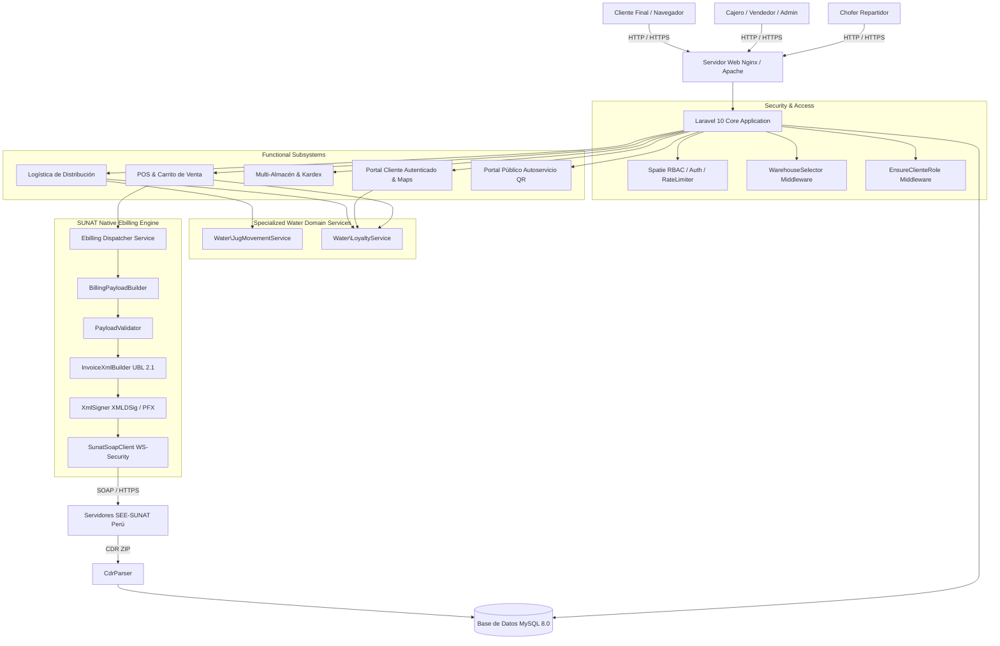
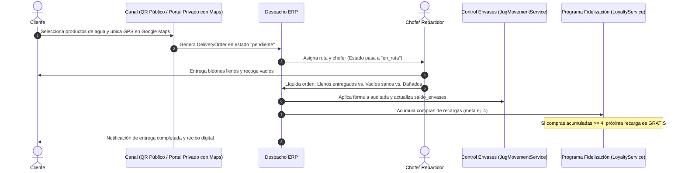

# PDR — Documento de Definición de Producto y Especificaciones Funcionales & Lógicas

**Sistema:** Pala-Sed ERP / EasyStock (Gestión Empresarial, Distribución de Agua, Envases Retornables & Facturación Electrónica SUNAT)  
**Versión:** 3.0 (Revisión Integral & Actualización de Módulos Operativos — Septiembre 2026)  
**Entorno Tecnológico:** PHP 8.3+ / Laravel 10.x / MySQL 8.0 / Bootstrap 5.3 / UBL 2.1 SUNAT  
**Emisor Fiscal Principal:** MYTEMS E.I.R.L. (RUC: 20610316884)  
**Estado Operativo:** 100% de Módulos Base y Tributarios Implementados e Integrados

---

## 1. Introducción y Visión General del Producto

### 1.1 Propósito y Alcance
**Pala-Sed ERP** (conocido internamente en interfaz de usuario como *EasyStock*) es una solución completa de planificación de recursos empresariales (ERP), punto de venta (POS) de alta velocidad, gestión multi-almacén, facturación electrónica nativa bajo la normativa SUNAT (Perú) y un ecosistema logístico de distribución especializado para la industria de **purificación, embotellado y comercialización de agua de mesa y bebidas**.

El sistema integra de forma nativa e interoperable todos los eslabones de la cadena comercial:

1. **Atención en Mostrador & POS:** Facturación ultrarrápida con lector de código de barras, soporte para Facturas (`01`), Boletas (`03`), Notas de Crédito (`07`), Notas de Débito (`08`) y Notas de Venta internas (`02`), pagos combinados/mixtos (Efectivo, Yape, Plin, Tarjeta, Transferencia) y ventas a crédito con cálculo de cuotas y fechas de vencimiento.
2. **Logística y Reparto a Domicilio (Delivery):** Ciclo completo del pedido (`pendiente` ➔ `en_ruta` ➔ `entregado` ➔ `cancelado`), asignación de rutas a choferes repartidores, programación por turnos (`mañana`, `tarde`, `noche`) y liquidación física en destino.
3. **Control de Envases Retornables (Botellones de 20L):** Libro mayor de comodatos y control de pérdidas de envases plásticos/PET en poder del cliente, reposición por daño y cálculo dinámico de saldo de envases.
4. **Fidelización Automatizada (4+1 / 5+1):** Monitoreo algorítmico de compras recurrentes de recargas de agua y bonificación automática de productos configurables tanto en POS como en los portales móviles.
5. **Autoservicio Omnicanal para Clientes (Doble Canal):**
   * **Portal Público QR (`/pedido`):** Escaneo sin instalación de app en el bidón de agua, consulta predictiva de cliente por teléfono/DNI y tracking del pedido en vivo (`/pedido/seguimiento/{code}`).
   * **Portal Privado Autenticado (`/cliente`):** Cuenta de usuario para clientes finales con rol `Cliente`, mapa interactivo con Google Maps API para geolocalización precisa de entrega, dashboard de consumo, historial de pedidos y estatus de fidelización.
6. **Gestión Multi-Almacén y Kardex Valorizado:** Existencias atomizadas por sucursal física, precios y costos independientes, transferencias inter-sucursales atómicas, auditoría de kardex físico valorizado y alertas de stock mínimo.
7. **Compras y Proveedores Fiscales:** Homologación de proveedores con consulta SUNAT/RENIEC, abastecimiento a almacén receptor, actualización del costo promedio y control de existencias físicas.
8. **Facturación Electrónica UBL 2.1 Nativa (SUNAT):** Sin dependencias de servicios externos ni costes por comprobante emitido. Genera, valida, firma digitalmente con certificado digital (`.pfx`/`.pem`), empaqueta en ZIP, transmite vía SOAP UBL 2.1 con WS-Security y parsea Constancias de Recepción (CDR).
9. **Guías de Remisión Electrónica Remitente (GRE Tipo 09):** Emisión para transporte público o privado con integración de datos vehiculares, conductores MTC y ubigeos de partida y llegada.

---

## 2. Métricas y Arquitectura Tecnológica del Sistema

### 2.1 Métricas Clave de la Base de Código
* **Controladores HTTP:** 35 controladores funcionales (`app/Http/Controllers/`: 31 en raíz, 1 en `Cliente/`, 3 en `Api/`, más el controlador base).
* **Modelos Eloquent:** 41 modelos en `app/Models/` con relaciones optimizadas y casts estrictos.
* **Migraciones de Base de Datos:** 45 migraciones ordenadas en `database/migrations/`.
* **Tablas en Base de Datos:** 51 tablas relacionales normalizadas.
* **Seeders del Sistema:** 25 seeders en `database/seeders/` con catálogos oficiales SUNAT, 1,874 distritos del Perú (INEI) y datos iniciales.
* **Rutas Registradas:** 274 rutas activas en `routes/web.php` y `routes/api.php`.
* **Roles de Acceso (RBAC):** 7 roles preconfigurados con Spatie Permission (`SUPERADMIN`, `ADMIN`, `VENDEDOR`, `CAJERO`, `CONTABILIDAD`, `REPARTIDOR`, `Cliente`).

### 2.2 Diagrama de Arquitectura

```mermaid
graph TD
    UserClient[Cliente Final / Navegador] -->|HTTP / HTTPS| WebServer[Servidor Web Nginx / Apache]
    Operator[Cajero / Vendedor / Admin] -->|HTTP / HTTPS| WebServer
    Driver[Chofer Repartidor] -->|HTTP / HTTPS| WebServer

    WebServer --> LaravelCore[Laravel 10 Core Application]

    subgraph Security & Access
        LaravelCore --> AuthMod[Spatie RBAC / Auth / RateLimiter]
        LaravelCore --> WhSelector[WarehouseSelector Middleware]
        LaravelCore --> ClienteAuth[EnsureClienteRole Middleware]
    end

    subgraph Functional Subsystems
        LaravelCore --> POSMod[POS & Carrito de Venta]
        LaravelCore --> DeliveryMod[Logística de Distribución]
        LaravelCore --> StockMod[Multi-Almacén & Kardex]
        LaravelCore --> ClientPortal[Portal Cliente Autenticado & Maps]
        LaravelCore --> PublicQR[Portal Público Autoservicio QR]
    end

    subgraph Specialized Water Domain Services
        DeliveryMod --> JugService[Water\JugMovementService]
        DeliveryMod --> LoyaltyService[Water\LoyaltyService]
        ClientPortal --> LoyaltyService
        POSMod --> LoyaltyService
    end

    subgraph SUNAT Native Ebilling Engine
        POSMod --> Ebilling[Ebilling Dispatcher Service]
        Ebilling --> Payload[BillingPayloadBuilder]
        Payload --> Validator[PayloadValidator]
        Validator --> XmlGen[InvoiceXmlBuilder UBL 2.1]
        XmlGen --> Signer[XmlSigner XMLDSig / PFX]
        Signer --> SoapClient[SunatSoapClient WS-Security]
    end

    SoapClient -->|SOAP / HTTPS| SUNAT[Servidores SEE-SUNAT Perú]
    SUNAT -->|CDR ZIP| CdrParser[CdrParser]
    CdrParser --> DB[(Base de Datos MySQL 8.0)]
    LaravelCore --> DB
```

### 2.3 Stack Técnico Detallado
* **Backend Framework:** Laravel 10.x sobre PHP 8.3+
* **Base de Datos:** MySQL 8.0+ / MariaDB 10.4+ con motor InnoDB
* **Frontend:** Laravel Blade, SB Admin Pro, Bootstrap 5.3, FontAwesome, SweetAlert2
* **Componentes Asíncronos:** jQuery 3.6, DataTables (Yajra Datatables para procesamiento en servidor)
* **Geolocalización:** Google Maps JavaScript API v3 (con marcador arrastrable y autocompletado)
* **Generación de Documentos:** `barryvdh/laravel-dompdf` (PDFs A4 y Tickets térmicos 80mm/58mm)
* **Códigos QR:** `simplesoftwareio/simple-qrcode` para comprobantes SUNAT y etiquetas físicas
* **Manejo Numérico:** `luecano/numero-a-letras` para glosas tributarias obligatorias
* **Exportación de Datos:** `maatwebsite/excel` (Registro PLE 14.1, inventarios y catálogos)
* **Firma Digital & Criptografía:** `openssl`, `ext-xml`, `ext-soap`, XMLDSig con canonicalización C14N

---

## 3. Especificaciones Exhaustivas de los Módulos del Sistema

### 3.1 Módulo 1: Autenticación, Usuarios y Control de Acceso (RBAC)
* **Controladores:** `LoginController`, `UserController`, `RoleController`
* **Modelos:** `User`, `Role`, `Permission`, `Warehouse`, `Cash`
* **Lógica Funcional:**
  * Acceso protegido por nombre de usuario (`user`) y contraseña con hash `bcrypt`.
  * **Seguridad contra Ataques de Fuerza Bruta:** `RateLimiter` integrado que bloquea la IP tras 5 intentos fallidos consecutivos por 60 segundos.
  * **Redirección Inteligente por Rol:**
    * Usuarios con rol `Cliente` son redirigidos inmediatamente a su portal privado (`cliente.dashboard`).
    * Usuarios operativos son evaluados para resolver su almacén de trabajo o redirigidos al selector de sucursales si poseen múltiples asignaciones.
  * **Configuración del Usuario Operativo:** Cada operador posee una caja física asignada (`idcaja`), un almacén activo (`idalmacen`) y acceso opcional a múltiples almacenes mediante la tabla `user_warehouse`.
  * **Matriz de Roles:**
    1. `SUPERADMIN`: Control absoluto del sistema, auditoría, configuración de empresa y certificados.
    2. `ADMIN`: Gestión operativa integral, compras, inventario, reportes y ventas.
    3. `VENDEDOR`: Acceso a POS, cotizaciones, notas de venta, guías y clientes.
    4. `CAJERO`: Operación exclusiva de caja física, ventas en mostrador y arqueos diarios.
    5. `CONTABILIDAD`: Reportes contables, registro de ventas oficial SUNAT y comprobantes.
    6. `REPARTIDOR`: Gestión de despachos, delivery y liquidación de envases en ruta.
    7. `Cliente`: Portal privado web, creación de pedidos con geolocalización y seguimiento.

### 3.2 Módulo 2: Configuración de Empresa y Parámetros Fiscales
* **Controlador:** `BusinessController`
* **Modelo:** `Business`
* **Lógica Funcional:**
  * Parámetros de la empresa emisora: RUC (20610316884), Razón Social (`MYTEMS E.I.R.L.`), Nombre Comercial, logo corporativo, dirección fiscal, código de país (`PE`) y Ubigeo de 6 dígitos con selector jerárquico dinámico (Departamento ➔ Provincia ➔ Distrito).
  * **Certificados Digitales:** Subida de archivo tributario `.pfx` o `.pem`, ingreso seguro de clave privada y validación de vigencia del certificado.
  * **Credenciales SOL de Emisión:** Registro de Usuario Secundario SOL y Clave SOL para facturación UBL 2.1.
  * **Ambientes SUNAT:** Selector de entorno `1` (Beta / Pruebas de homologación) o `2` (Producción real en línea).
  * **Guías de Remisión (GRE):** Almacenamiento de `gre_client_id` y `gre_client_secret` para autenticación OAuth2 ante la API REST de SUNAT.
  * **Parámetros Tributarios y Mensajería:** Toggle global `cobrar_igv` e identificador `instancia_wpp` para envío automático de tickets por WhatsApp.

### 3.3 Módulo 3: Series y Correlativos de Documentos
* **Controlador:** `SerieController`
* **Modelo:** `Serie`
* **Lógica Funcional:**
  * Mantenimiento de series alfanuméricas reglamentarias según el catálogo SUNAT:
    * Facturas Electrónicas: Prefijo `F` (ej. `F001`).
    * Boletas de Venta Electrónicas: Prefijo `B` (ej. `B001`).
    * Notas de Crédito: Prefijos `FC01` (para facturas) y `BC01` (para boletas).
    * Notas de Débito: Prefijos `FD01` y `BD01`.
    * Guías de Remisión Remitente: Prefijo `T` (ej. `T001`).
    * Notas de Venta Internas: Prefijo `NV` (ej. `NV01`).
  * Vinculación obligatoria por sucursal física/caja, control de correlativo actual y estado activo/inactivo.

### 3.4 Módulo 4: Formas y Métodos de Pago
* **Controlador:** `PayModeController`
* **Modelo:** `PayMode`
* **Lógica Funcional:**
  * Gestión de modalidades y pasarelas de pago aceptadas en caja y delivery:
    * Efectivo (PEN)
    * Billeteras Digitales (Yape, Plin)
    * Tarjetas de Débito y Crédito (Visa, Mastercard, etc.)
    * Transferencia Bancaria (BCP, BBVA, Interbank)
  * Asignación en los desgloses de pago (`DetailPayment`) tanto en ventas al contado como en liquidaciones de reparto.

### 3.5 Módulo 5: Cajas Físicas y Arqueos de Caja
* **Controladores:** `CashController`, `ArchingCashController`
* **Modelos:** `Cash`, `ArchingCash`, `DetailPayment`
* **Lógica Funcional:**
  * **Cajas Físicas:** Catálogo de puntos de cobro físicos en los locales.
  * **Apertura de Caja (`arching_cash.save`):** Registro de fecha, hora y monto inicial en efectivo. La caja pasa a estado `1` (Abierta).
  * **Candado de Seguridad Operativa:** El POS, ventas y emisión exigen obligatoriamente que el usuario posea una caja abierta activa en la sesión. De lo contrario, se bloquea la transacción y se redirige a la pantalla de apertura.
  * **Movimientos Extraordinarios de Efectivo:**
    * Depósitos (`save-deposit`): Registro de ingresos extraordinarios con justificación y comprobante.
    * Retiros (`save-withdrawal`): Registro de egresos o salidas de dinero con validación previa de saldo suficiente en caja.
  * **Cierre de Caja y Cuadre Automatizado (`admin.close_cash`):**
    * Cruce matemático en tiempo real entre monto inicial, ventas en efectivo, cobros electrónicos (Yape, Plin, tarjetas), depósitos y retiros.
    * Cálculo de monto esperado versus monto físico declarado por el cajero, calculando discrepancias (faltante o sobrante).
    * Generación e impresión de ticket térmico de cierre y resumen detallado.

### 3.6 Módulo 6: Directorio Unificado de Clientes y Control de Envases
* **Controlador:** `ClientController`
* **Modelos:** `Client`, `IdentityDocumentType`
* **Lógica Funcional:**
  * Catálogo de clientes particulares y corporativos con discriminación de tipo de documento (DNI `1`, RUC `6`, Pasaporte `7`, Carnet de Extranjería `4`).
  * **Consulta Automática en Tiempo Real:** Integración con servicio API para autocompletar nombres/razón social y dirección fiscal a partir del DNI o RUC.
  * **Trazabilidad de Envases Retornables (`saldo_envases`):** Campo cuantitativo auditado en tiempo real que refleja el número exacto de botellones vacíos de 20L en poder del cliente.
  * Datos logísticos de reparto: Dirección exacta, referencia urbana de entrega y coordenadas GPS (latitud y longitud).

### 3.7 Módulo 7: Proveedores Fiscales
* **Controlador:** `ProviderController`
* **Modelos:** `Provider`, `Client`, `IdentityDocumentType`
* **Lógica Funcional:**
  * Módulo formalizado de proveedores para respaldar el proceso de compras y abastecimiento.
  * Registro de RUC (11 dígitos) o documento de identidad, razón social, dirección fiscal, teléfono, correo y ubigeo de 6 dígitos.
  * Consulta automática a SUNAT por RUC para alta rápida de proveedores con validación de no duplicidad.

### 3.8 Módulo 8: Catálogo de Productos y Servicios
* **Controlador:** `ProductController`
* **Modelos:** `Product`, `Category`, `Unit`, `IgvTypeAffection`
* **Lógica Funcional:**
  * **Clasificación Estricta (`opcion`):**
    * `opcion = 1`: **Producto Físico** (genera movimientos de inventario, stock en almacenes y kardex).
    * `opcion = 2`: **Servicio** (intangible; no consume existencias ni afecta almacenes).
  * Identificación: Código SKU interno, código de barras EAN-13 para pistola lectora y código estándar SUNAT (ej. `50202301` para agua purificada).
  * Estructura de Precios: Precio de Compra base y Precio de Venta público.
  * Tributación SUNAT: Asignación a tipo de afectación al IGV (`10` Gravado, `20` Exonerado, `30` Inafecto, `21` Gratuito).
  * Operaciones Masivas: Carga de productos mediante plantilla Excel (.xlsx) y exportación del catálogo completo.

### 3.9 Módulo 9: Gestión Multi-Almacén y Stock Atomizado
* **Controlador:** `WarehouseController`
* **Modelos:** `Warehouse`, `StockProduct`, `Product`
* **Lógica Funcional:**
  * Soporte integral para múltiples sucursales y bodegas físicas (`warehouses`).
  * **Stock Descentralizado (`stock_products`):** Cada sucursal administra sus propias existencias, precio de compra, precio de venta sugerido y umbral de stock mínimo.
  * Alertas visuales de stock bajo y agotado.
  * **Suma Rápida con Pistola Lectora (`barcode_sum`):** Ajuste de existencias al vuelo escaneando repetidamente el código de barras físico del producto.
  * Importación y exportación de inventarios valorizados por almacén en formato Microsoft Excel.

### 3.10 Módulo 10: Selector Dinámico de Establecimiento en Sesión
* **Controlador:** `WarehouseSelectorController`
* **Middleware:** `EnsureWarehouseSelection`
* **Lógica Funcional:**
  * Permite a usuarios con permisos multi-sucursal conmutar en caliente su almacén activo durante la sesión sin cerrar sesión.
  * Garantiza que todas las transacciones de ventas, despachos, transferencias y consultas de stock se ejecuten en el contexto de la sucursal seleccionada.

### 3.11 Módulo 11: Órdenes de Traslado entre Almacenes
* **Controlador:** `TransferOrderController`
* **Modelos:** `TransferOrder`, `DetailTransferOrder`, `StockProduct`
* **Lógica Funcional:**
  * Transferencia segura de productos entre almacenes de la empresa.
  * Flujo operativo:
    1. Creación de orden especificando sucursal origen y sucursal destino.
    2. Carga de productos mediante carrito validando stock disponible en el origen.
    3. Aprobación y ejecución del movimiento (`move`): En una transacción atómica `DB::transaction`, descuenta el inventario del almacén emisor e incrementa las existencias en el almacén receptor.
    4. Anulación (`anulled`): Reversión automática de existencias si la orden ya fue ejecutada.
    5. Impresión de comprobante de guía de traslado interno en formato PDF.

### 3.12 Módulo 12: Control de Kardex Físico Valorizado
* **Controlador:** `KardexController`
* **Lógica Funcional:**
  * Auditoría y trazabilidad cronológica de entradas, salidas y saldos físicos de mercadería.
  * Mapea de forma integrada: Compras (+), Ventas (-), Transferencias Salientes (-), Transferencias Entrantes (+) y Ajustes de Inventario (+/-).
  * Filtros interactivos por producto, establecimiento y rango de fechas.

### 3.13 Módulo 13: Compras y Abastecimiento a Proveedores
* **Controlador:** `BuyController`
* **Modelos:** `Buy`, `DetailBuy`, `StockProduct`, `Product`, `Client` / `Provider`
* **Lógica Funcional:**
  * Registro de adquisiciones con respaldo documental (Factura, Boleta, Guía del proveedor).
  * Selección de almacén de ingreso de la mercadería.
  * Carrito de compras con cálculo de subtotal, IGV y total.
  * **Actualización Automática de Costos:** Al registrar la compra, se actualiza el `precio_compra` en `products` y en `stock_products` del almacén receptor.
  * **Impacto en Inventario:** Incrementa automáticamente el stock disponible exclusivamente para productos con `opcion == 1`.
  * Modalidades de pago: Contado y Crédito. Impresión de comprobante de compra en PDF.

### 3.14 Módulo 14: Cotizaciones Comerciales y Conversión a Venta
* **Controlador:** `QuoteController`
* **Modelos:** `Quote`, `DetailQuote`, `Product`, `Client`
* **Lógica Funcional:**
  * Elaboración ágil de presupuestos con especificación de cliente, validez de la oferta y condiciones comerciales.
  * Impresión multiformato: PDF en formato oficial A4 con logo corporativo y formato Ticket térmico.
  * Envío directo por correo electrónico al cliente con archivo PDF adjunto.
  * **Conversión a Venta en 1 Clic (`convert_to_sale`):** Migra la cotización aprobada directamente al módulo POS, precargando el cliente y los productos en el carrito para su facturación inmediata.

### 3.15 Módulo 15: Punto de Venta (POS Omnicanal de Alta Velocidad)
* **Controlador:** `PosController`
* **Modelos:** `Billing`, `SaleNote`, `DetailBilling`, `DetailSaleNote`, `DetailPayment`, `StockProduct`, `Serie`, `ArchingCash`
* **Lógica Funcional:**
  * Carrito en sesión de alta velocidad con soporte para pistola lectora de código de barras y atajos de teclado.
  * Búsqueda predictiva de productos por nombre o SKU.
  * **Selección de Tipo de Comprobante:**
    * Factura Electrónica (`01`): Valida obligatoriamente que el cliente posea RUC de 11 dígitos válido.
    * Boleta de Venta Electrónica (`03`): Valida DNI del cliente si el importe supera los S/ 700.00.
    * Nota de Venta Interna (`02`): Documento administrativo sin envío tributario a SUNAT.
  * **Condiciones de Pago Flexibles:**
    * **Contado:** Soporte para pagos combinados/mixtos en múltiples medios (`payments`: Efectivo + Yape + Tarjeta) con cálculo automático de vuelto.
    * **Crédito:** Configuración de cronograma de cuotas con fecha de vencimiento y montos que cuadran con el saldo financiado.
  * **Verificación de Inventario:** Valida existencias en el almacén activo y descuenta stock únicamente si `opcion == 1`.
  * **Despacho Tributario Inmediato:** Invoca atómicamente al motor UBL 2.1 para firmar y enviar el comprobante a SUNAT, generando el código QR oficial y retornando enlaces de impresión en ticket (80mm/58mm) y A4.

### 3.16 Módulo 16: Facturación Electrónica Nativa UBL 2.1 (SUNAT) y API REST
* **Controladores:** `BillingController`, `Api\SunatDispatchController`, `Api\SunatBillingPayloadController`, `Api\SunatValidationController`
* **Servicios:** Espacio de nombres `App\Services\Ebilling\*`
* **Flujo del Motor Tributario:**
  1. `BillingPayloadBuilder`: Ensambla el payload canónico conforme a las estructuras OASIS UBL 2.1 y catálogos de SUNAT.
  2. `PayloadValidator`: Valida tipos de documento, longitudes de RUC/DNI, consistencia de bases gravadas, inafectas, exoneradas, IGV y sumatorias de cuotas.
  3. `InvoiceXmlBuilder`: Construye el XML UBL 2.1 con namespaces `cac`, `cbc`, `ext`, `ds`.
  4. `XmlSigner`: Aplica firma digital XMLDSig SHA-1/RSA con el certificado `.pfx` de la empresa y digestión canónica C14N.
  5. `SunatSoapClient`: Empaqueta el XML firmado en archivo ZIP y transmite vía SOAP con WS-Security al servidor de SUNAT.
  6. `CdrParser`: Descomprime el archivo de Constancia de Recepción `R-*.zip`, analiza el código de estado (0 = Aceptado, >0 = Observaciones o Rechazo) y extrae la descripción oficial.
* **Notas de Crédito y Débito:** Emisión con referencia al comprobante de origen, motivo del catálogo SUNAT y afectación contable/stock.
* **Descarga de Evidencias:** Descarga directa de XML firmado (`download_xml`) y constancia CDR oficial (`download_cdr`).
* **Reintento Manual (`dispatch`):** Reenvío de comprobantes con problemas de comunicación o pendientes.
* **API REST Externa:** Endpoints `/api/sunat/*` para validación, payload y despacho programático.

### 3.17 Módulo 17: Notas de Venta Internas
* **Controlador:** `SaleNoteController`
* **Modelos:** `SaleNote`, `DetailSaleNote`, `DetailPayment`, `StockProduct`
* **Lógica Funcional:**
  * Documentos de venta para control administrativo interno sin envío a SUNAT.
  * Impresión en ticket térmico y formato PDF A4.
  * Envío por correo electrónico.
  * **Anulación con Reversión de Stock (`anulled`):** Cancela el documento y restituye automáticamente las existencias físicas al almacén emisor.

### 3.18 Módulo 18: Guías de Remisión Electrónica Remitente (GRE Tipo 09)
* **Controlador:** `ShipmentGuideController`
* **Modelos:** `ShipmentGuide`, `ShipmentGuideItem`, `Business`
* **Lógica Funcional:**
  * Emisión de Guías de Remisión Electrónica Remitente (Tipo `09`).
  * Modalidades de traslado: Transporte Público (con datos de la empresa de transporte) y Transporte Privado (con conductor, licencia MTC y placas vehiculares principal y secundaria).
  * Peso bruto total en KGM y número de bultos.
  * Puntos de partida y llegada con dirección fiscal y código de Ubigeo INEI de 6 dígitos.
  * Impresión de ticket y formato A4 para fiscalización en ruta.

### 3.19 Módulo 19: Distribución Logística de Agua y Despacho a Domicilio
* **Controlador:** `DeliveryController`
* **Modelos:** `DeliveryOrder`, `DeliveryOrderItem`, `User`, `Client`
* **Servicios:** `Water\JugMovementService`, `Water\LoyaltyService`
* **Lógica Funcional:**
  * Ciclo de vida del despacho:
    * `pendiente`: Pedido recibido desde portal público QR, portal privado del cliente o panel administrativo.
    * `en_ruta`: Asignado a un chofer repartidor (rol `REPARTIDOR`).
    * `entregado`: Liquidado exitosamente en destino.
    * `cancelado`: Cancelación documentada.
  * Programación por fecha y franja horaria (`mañana`, `tarde`, `noche`).
  * **Liquidación de Entrega (`complete`):**
    * Registro de botellones llenos entregados (`bidones_a_entregar`).
    * Registro de botellones vacíos sanos recogidos (`bidones_vacios_recibidos`).
    * Registro de botellones dañados o rotos (`bidones_danados_recibidos`).
    * Cobro de penalidad económica por envases rotos (`cobro_envases_danados`), incorporándose al monto final.
    * Enlace a POS (`toPOS`) para emisión de comprobante tributario inmediato.
  * Generador de códigos QR listos para imprimir y adherir a los bidones (`/deliveries/qr`).

### 3.20 Módulo 20: Control de Envases Retornables y Comodatos (Botellones 20L)
* **Controlador:** `JugMovementController`
* **Servicio:** `App\Services\Water\JugMovementService`
* **Modelos:** `JugMovement`, `Client`
* **Lógica Funcional:**
  * Control del inventario de botellones de policarbonato/PET de 20 litros en poder del cliente.
  * **Fórmula de Balance de Envases:**
    $$\text{Saldo Nuevo} = \text{Saldo Anterior} + \text{Llenos Entregados} - (\text{Vacíos Sanos} + \text{Dañados Retirados})$$
  * Tipos de movimiento: `entrega_recarga`, `devolucion`, `venta_envase`, `ajuste`.
  * Historial cronológico auditable por cliente accesible desde su ficha y en su portal.

### 3.21 Módulo 21: Programa de Fidelización Automatizado (4+1 / 5+1)
* **Controlador:** `LoyaltyController`
* **Servicio:** `App\Services\Water\LoyaltyService`
* **Modelos:** `LoyaltyPromotion`, `ClientLoyalty`, `Client`
* **Lógica Funcional:**
  * Reglas de fidelidad para incentivar la compra recurrente de agua.
  * Parámetros configurables: meta de compras (ej. 4 recargas), producto meta (Recarga 20L), bonificación (1 unidad) y producto premiado.
  * Acumulación automática en cada venta o reparto de recargas elegibles.
  * Alerta de premio en POS y portales web cuando `compras_acumuladas >= meta_compras`.
  * Canje de recompensas (`redeem_reward`): descuenta la meta, preserva excedentes y actualiza el contador histórico de premios reclamados.

### 3.22 Módulo 22: Portal Público de Autoservicio por Código QR
* **Controlador:** `PublicQrOrderController`
* **Vistas:** `resources/views/public/order_qr.blade.php`, `resources/views/public/order_tracking.blade.php`
* **Rutas:** `/pedido`, `/pedidos-qr`, `/pedido/seguimiento/{code}`
* **Lógica Funcional:**
  * Acceso público sin login para clientes que escanean la etiqueta QR pegada en su bidón.
  * Consulta inteligente por teléfono o DNI (`check_client`): si el cliente ya existe, precarga su nombre, dirección habitual y muestra su saldo de fidelización. Si es nuevo, permite registrar sus datos en el momento.
  * Selección de recargas de agua, botellones nuevos o dispensadores.
  * Notificación de cantidad de envases vacíos a retornar, franja horaria y método de pago.
  * Generación de código de seguimiento único (ej. `ORD-84920`) y pantalla de rastreo en vivo con línea de tiempo del despacho.

### 3.23 Módulo 23: Portal Privado Autenticado de Clientes (con Google Maps)
* **Controlador:** `Cliente\ClientePortalController`
* **Middleware:** `EnsureClienteRole`
* **Vistas:** `resources/views/cliente/` (`dashboard`, `order`, `tracking`, `layout`)
* **Rutas:** `/cliente/dashboard`, `/cliente/pedido/nuevo`, `/cliente/pedido/store`, `/cliente/pedido/{code}`
* **Lógica Funcional:**
  * Experiencia web dedicada para clientes registrados con rol `Cliente`.
  * **Dashboard Personal:** Resumen de consumo, saldo de envases en su poder, widget interactivo de fidelización y listado de últimos pedidos.
  * **Nuevo Pedido con Mapa Interactivo (Google Maps API):**
    * Selección de productos del catálogo de agua.
    * Mapa interactivo de geolocalización con marcador arrastrable para fijar las coordenadas GPS (`lat,lng`) exactas de la entrega.
    * Autocompletado de dirección y referencia.
    * Selección de fecha de entrega, turno y método de pago.
  * **Tracking en Vivo:** Monitoreo en tiempo real del repartidor asignado y el estado del pedido.

### 3.24 Módulo 24: Reportes Contables Oficiales (PLE 14.1) y Analítica
* **Controladores:** `BillingReportController`, `ReportSalesController`, `ReportPaymentController`
* **Lógica Funcional:**
  * **Registro de Ventas Oficial SUNAT (Formato PLE 14.1 / RVIE):**
    * Exportación a PDF oficial y libro electrónico en Microsoft Excel (.xlsx).
    * Columnas normativas completas: Fecha de emisión, fecha de vencimiento, tipo de comprobante, serie, correlativo, documento del cliente, base gravada, exonerada, inafecta, IGV y total.
  * **Reporte de Documentos Electrónicos:** Detalle de comprobantes con estado de envío a SUNAT, respuesta CDR y enlaces a XML/CDR.
  * **Reporte de Notas de Crédito:** Detalle de anulaciones, notas de crédito emitidas y comprobantes modificados.
  * **Reporte de Ventas por Período y por Producto:** Estadísticas de cantidades vendidas y recaudación por producto.
  * **Reporte Consolidado de Medios de Pago:** Desglose financiero de recaudación por Efectivo, Tarjeta, Transferencia, Yape y Plin.

### 3.25 Módulo 25: Dashboard y Métricas Ejecutivas en Tiempo Real
* **Controlador:** `HomeController`
* **Vistas:** `resources/views/admin/home.blade.php`
* **Lógica Funcional:**
  * Métricas del día y del mes: total vendido, pedidos de delivery pendientes y en ruta, comprobantes emitidos.
  * Gráficas interactivas: ventas mensuales, evolución de ingresos y desglose porcentual por métodos de pago.

---

## 4. Matriz Completa de Controladores y Rutas del Sistema

A continuación se detalla el mapa integral de endpoints de la aplicación:

| Método | URI | Nombre de Ruta | Controlador@Método | Middleware / Permiso |
| :--- | :--- | :--- | :--- | :--- |
| **GET** | `/` | `login` | `LoginController@index` | `guest` |
| **POST** | `/login/login` | `login.login` | `LoginController@login` | Web |
| **POST** | `/login/register` | `login.register` | `LoginController@register` | `guest` |
| **GET** | `/login/logout` | `login.logout` | `LoginController@logout` | Web |
| **GET** | `/home` | `admin.home` | `HomeController@index` | `auth`, `can:admin.home` |
| **GET** | `/home/ventas-mensuales` | `home.ventas_mensuales` | `HomeController@ventasMensuales` | `auth`, `can:admin.home` |
| **GET** | `/home/reporte-ingresos` | `home.reporte_ingresos` | `HomeController@reporteIngresos` | `auth`, `can:admin.home` |
| **GET** | `/home/metodo-pagos` | `home.metodo_pagos` | `HomeController@metodosPagoVentas` | `auth`, `can:admin.home` |
| **GET** | `/establishment` | `warehouse.selector.index` | `WarehouseSelectorController@index` | `auth` |
| **POST** | `/establishment/select` | `warehouse.selector.store` | `WarehouseSelectorController@store` | `auth` |
| **GET** | `/cliente/dashboard` | `cliente.dashboard` | `ClientePortalController@dashboard` | `auth`, `cliente` |
| **GET** | `/cliente/pedido/nuevo` | `cliente.order` | `ClientePortalController@order` | `auth`, `cliente` |
| **POST** | `/cliente/pedido/store` | `cliente.order.store` | `ClientePortalController@storeOrder` | `auth`, `cliente` |
| **GET** | `/cliente/pedido/{code}` | `cliente.tracking` | `ClientePortalController@tracking` | `auth`, `cliente` |
| **GET** | `/cliente/logout` | `cliente.logout` | `ClientePortalController@logout` | `auth`, `cliente` |
| **GET** | `/business` | `admin.business` | `BusinessController@index` | `auth`, `can:admin.business` |
| **POST** | `/business/save-info` | `business.save_info` | `BusinessController@save_info` | `auth`, `can:admin.business` |
| **POST** | `/business/save-sunat` | `business.save_sunat` | `BusinessController@save_sunat` | `auth`, `can:admin.business` |
| **POST** | `/business/load-logo` | `business.load_logo` | `BusinessController@load_logo` | `auth`, `can:admin.business` |
| **POST** | `/business/load-ubigeo` | `admin.load_ubigeo` | `BusinessController@load_ubigeo` | `auth`, `can:admin.business` |
| **POST** | `/business/load-provinces` | `admin.load_provinces` | `BusinessController@load_provinces` | `auth`, `can:admin.business` |
| **POST** | `/business/load-districts` | `admin.load_districts` | `BusinessController@load_districts` | `auth`, `can:admin.business` |
| **GET** | `/cashes` | `admin.cashes` | `CashController@index` | `auth`, `can:admin.cashes` |
| **GET** | `/cashes/get` | `cashes.get` | `CashController@get` | `auth`, `can:admin.cashes` |
| **POST** | `/cashes/save` | `cashes.save` | `CashController@save` | `auth`, `can:admin.cashes` |
| **POST** | `/cashes/detail` | `cashes.detail` | `CashController@detail` | `auth`, `can:admin.cashes` |
| **POST** | `/cashes/store` | `cashes.store` | `CashController@store` | `auth`, `can:admin.cashes` |
| **POST** | `/cashes/delete` | `cashes.delete` | `CashController@delete` | `auth`, `can:admin.cashes` |
| **GET** | `/pay-modes` | `admin.paymodes` | `PayModeController@index` | `auth`, `can:admin.paymodes` |
| **GET** | `/pay-modes/get` | `paymodes.get` | `PayModeController@get` | `auth`, `can:admin.paymodes` |
| **POST** | `/pay-modes/save` | `paymodes.save` | `PayModeController@save` | `auth`, `can:admin.paymodes` |
| **POST** | `/pay-modes/detail` | `paymodes.detail` | `PayModeController@detail` | `auth`, `can:admin.paymodes` |
| **POST** | `/pay-modes/store` | `paymodes.store` | `PayModeController@store` | `auth`, `can:admin.paymodes` |
| **POST** | `/pay-modes/delete` | `paymodes.delete` | `PayModeController@delete` | `auth`, `can:admin.paymodes` |
| **GET** | `/series` | `admin.series` | `SerieController@index` | `auth`, `can:admin.series` |
| **GET** | `/series/get` | `series.get` | `SerieController@get` | `auth`, `can:admin.series` |
| **POST** | `/series/save` | `series.save` | `SerieController@save` | `auth`, `can:admin.series` |
| **POST** | `/series/detail` | `series.detail` | `SerieController@detail` | `auth`, `can:admin.series` |
| **POST** | `/series/store` | `series.store` | `SerieController@store` | `auth`, `can:admin.series` |
| **POST** | `/series/delete` | `series.delete` | `SerieController@delete` | `auth`, `can:admin.series` |
| **GET** | `/countries` | `admin.countries` | `CountryController@index` | `auth` |
| **GET** | `/countries/get` | `countries.get` | `CountryController@get` | Web |
| **POST** | `/countries/save` | `countries.save` | `CountryController@save` | Web |
| **POST** | `/countries/detail` | `countries.detail` | `CountryController@detail` | Web |
| **POST** | `/countries/store` | `countries.store` | `CountryController@store` | Web |
| **POST** | `/countries/delete` | `countries.delete` | `CountryController@delete` | Web |
| **GET** | `/clients` | `admin.clients` | `ClientController@index` | `auth`, `can:admin.clients` |
| **GET** | `/clients/get` | `clients.get` | `ClientController@get` | `auth`, `can:admin.clients` |
| **POST** | `/clients/search-document` | `admin.search_client_document_record` | `ClientController@searchDocument` | `auth`, `can:admin.clients` |
| **POST** | `/clients/save` | `clients.save` | `ClientController@save` | `auth`, `can:admin.clients` |
| **POST** | `/clients/detail` | `clients.detail` | `ClientController@detail` | `auth`, `can:admin.clients` |
| **POST** | `/clients/store` | `clients.store` | `ClientController@store` | `auth`, `can:admin.clients` |
| **POST** | `/clients/delete` | `clients.delete` | `ClientController@delete` | `auth`, `can:admin.clients` |
| **GET** | `/providers` | `admin.providers` | `ProviderController@index` | `auth`, `can:admin.providers` |
| **GET** | `/providers/get` | `providers.get` | `ProviderController@get` | `auth`, `can:admin.providers` |
| **POST** | `/providers/search-document` | `admin.search_provider_document_record` | `ProviderController@searchDocument` | `auth`, `can:admin.providers` |
| **POST** | `/providers/save` | `providers.save` | `ProviderController@save` | `auth`, `can:admin.providers` |
| **POST** | `/providers/detail` | `providers.detail` | `ProviderController@detail` | `auth`, `can:admin.providers` |
| **POST** | `/providers/store` | `providers.store` | `ProviderController@store` | `auth`, `can:admin.providers` |
| **POST** | `/providers/delete` | `providers.delete` | `ProviderController@delete` | `auth`, `can:admin.providers` |
| **GET** | `/categories` | `admin.categories` | `CategoryController@index` | `auth`, `can:admin.categories` |
| **GET** | `/categories/get` | `categories.get` | `CategoryController@get` | `auth`, `can:admin.categories` |
| **POST** | `/categories/save` | `categories.save` | `CategoryController@save` | `auth`, `can:admin.categories` |
| **POST** | `/categories/detail` | `categories.detail` | `CategoryController@detail` | `auth`, `can:admin.categories` |
| **POST** | `/categories/store` | `categories.store` | `CategoryController@store` | `auth`, `can:admin.categories` |
| **POST** | `/categories/delete` | `categories.delete` | `CategoryController@delete` | `auth`, `can:admin.categories` |
| **GET** | `/products` | `admin.products` | `ProductController@index` | `auth`, `can:admin.products` |
| **GET** | `/products/get` | `products.get` | `ProductController@get` | `auth`, `can:admin.products` |
| **POST** | `/products/save` | `products.save` | `ProductController@save` | `auth`, `can:admin.products` |
| **POST** | `/products/detail` | `products.detail` | `ProductController@detail` | `auth`, `can:admin.products` |
| **POST** | `/products/store` | `products.store` | `ProductController@store` | `auth`, `can:admin.products` |
| **POST** | `/products/delete` | `products.delete` | `ProductController@delete` | `auth`, `can:admin.products` |
| **POST** | `/products/upload-excel` | `products.upload_excel` | `ProductController@upload` | `auth`, `can:admin.products` |
| **GET** | `/products/download-excel` | `products.download_excel` | `ProductController@download` | `auth`, `can:admin.products` |
| **POST** | `/products/view-detail` | `products.view_detail` | `ProductController@view_detail` | `auth`, `can:admin.products` |
| **GET** | `/warehouses` | `admin.warehouses` | `WarehouseController@index` | `auth`, `can:admin.warehouses` |
| **GET** | `/warehouses/get` | `warehouses.get` | `WarehouseController@get` | `auth`, `can:admin.warehouses` |
| **POST** | `/warehouses/save` | `warehouses.save` | `WarehouseController@save` | `auth` |
| **POST** | `/warehouses/detail` | `warehouses.detail` | `WarehouseController@detail` | `auth`, `can:admin.warehouses` |
| **POST** | `/warehouses/store` | `warehouses.store` | `WarehouseController@store` | `auth`, `can:admin.warehouses` |
| **POST** | `/warehouses/delete` | `warehouses.delete` | `WarehouseController@delete` | `auth`, `can:admin.warehouses` |
| **GET** | `/warehouses/{id}` | `admin.products_warehouse` | `WarehouseController@products` | `auth`, `can:admin.warehouses` |
| **POST** | `/warehouses/list` | `admin.list_products_warehouse` | `WarehouseController@list_products` | `auth`, `can:admin.warehouses` |
| **POST** | `/warehouses/get-prod-warehouse` | `admin.get_product_warehouse` | `WarehouseController@get_prod_warehouse` | `auth`, `can:admin.warehouses` |
| **POST** | `/warehouses/get-detail` | `admin.get_detail_products` | `WarehouseController@get_detail_products` | `auth`, `can:admin.warehouses` |
| **POST** | `/warehouses/save-product` | `admin.save_product_stock` | `WarehouseController@save_product_stock` | `auth`, `can:admin.warehouses` |
| **POST** | `/warehouses/store-product` | `admin.store_product_stocks` | `WarehouseController@store_product_stocks` | `auth`, `can:admin.warehouses` |
| **POST** | `/warehouses/save-products-all` | `admin.save_products_stock_all` | `WarehouseController@save_products_all` | `auth`, `can:admin.warehouses` |
| **POST** | `/warehouses/detail-stock` | `admin.detail_stock_product` | `WarehouseController@detail_stock` | `auth`, `can:admin.warehouses` |
| **POST** | `/warehouses/detail-sum` | `admin.detail_sum_product` | `WarehouseController@detail_sum` | `auth`, `can:admin.warehouses` |
| **POST** | `/warehouses/store-stock` | `admin.store_stock_product` | `WarehouseController@store_stock` | `auth`, `can:admin.warehouses` |
| **POST** | `/warehouses/sum-stock` | `admin.sum_stock_product` | `WarehouseController@sum_stock` | `auth`, `can:admin.warehouses` |
| **POST** | `/warehouses/barcode_sum` | `admin.barcode_sum_product` | `WarehouseController@barcode_sum` | `auth`, `can:admin.warehouses` |
| **POST** | `/warehouses/delete-stock` | `admin.delete_stock_product` | `WarehouseController@delete_stock` | `auth`, `can:admin.warehouses` |
| **GET** | `/warehouses/export-products/{id}` | `admin.export_products_warehouse` | `WarehouseController@export_products` | `auth`, `can:admin.warehouses` |
| **POST** | `/warehouses/upload-excel` | `admin.upload_excel_warehouse` | `WarehouseController@upload_excel_products` | `auth`, `can:admin.warehouses` |
| **GET** | `/transferorders` | `admin.transfer_orders` | `TransferOrderController@index` | `auth`, `can:admin.transfer_orders` |
| **GET** | `/transferorders/create` | `admin.create_transfer_order` | `TransferOrderController@create` | `auth`, `can:admin.transfer_orders` |
| **GET** | `/transferorders/get-transfer-orders` | `admin.get_transfer_orders` | `TransferOrderController@get` | `auth`, `can:admin.transfer_orders` |
| **POST** | `/transferorders/load-serie-transfer` | `admin.load_serie_transfer` | `TransferOrderController@load_serie` | `auth`, `can:admin.transfer_orders` |
| **POST** | `/transferorders/load-warehouse-office` | `admin.load_warehouse_office` | `TransferOrderController@load_warehouse_office` | `auth`, `can:admin.transfer_orders` |
| **POST** | `/transferorders/load-warehouse-dispatch` | `admin.load_warehouse_dispatch` | `TransferOrderController@load_warehouse_dispatch` | `auth`, `can:admin.transfer_orders` |
| **POST** | `/transferorders/load-cart-transfer` | `admin.load_cart_transfer` | `TransferOrderController@load_cart` | `auth`, `can:admin.transfer_orders` |
| **POST** | `/transferorders/search-product-transfer` | `admin.search_product_transfer` | `TransferOrderController@search_product` | `auth`, `can:admin.transfer_orders` |
| **POST** | `/transferorders/detail-product-transfer` | `admin.detail_product_transfer` | `TransferOrderController@detail_product` | `auth`, `can:admin.transfer_orders` |
| **POST** | `/transferorders/add-product-transfer` | `admin.add_product_transfer` | `TransferOrderController@add_product` | `auth`, `can:admin.transfer_orders` |
| **POST** | `/transferorders/delete-product-transfer` | `admin.delete_product_transfer` | `TransferOrderController@delete_product` | `auth`, `can:admin.transfer_orders` |
| **POST** | `/transferorders/store-product-transfer` | `admin.store_product_transfer` | `TransferOrderController@store_product` | `auth`, `can:admin.transfer_orders` |
| **POST** | `/transferorders/save-transfer` | `admin.save_transfer` | `TransferOrderController@save` | `auth`, `can:admin.transfer_orders` |
| **POST** | `/transferorders/detail-transfer` | `admin.detail_transfer` | `TransferOrderController@detail` | `auth`, `can:admin.transfer_orders` |
| **POST** | `/transferorders/anulled-transfer` | `admin.anulled_tansfer_order` | `TransferOrderController@anulled` | `auth`, `can:admin.transfer_orders` |
| **POST** | `/transferorders/move-transfer` | `admin.move_transfer` | `TransferOrderController@move` | `auth`, `can:admin.transfer_orders` |
| **POST** | `/transferorders/print-transfer` | `admin.print_transfer` | `TransferOrderController@print` | `auth`, `can:admin.transfer_orders` |
| **GET** | `/kardex` | `admin.kardex` | `KardexController@index` | `auth`, `can:admin.products` |
| **GET** | `/quotes` | `admin.quotes` | `QuoteController@index` | `auth`, `can:admin.quotes` |
| **GET** | `/quotes/get` | `quotes.get` | `QuoteController@get` | `auth`, `can:admin.quotes` |
| **GET** | `/quotes/create` | `admin.create_quote` | `QuoteController@create` | `auth`, `can:admin.quotes` |
| **GET** | `/quotes/q{id}` | `admin.edit_quote` | `QuoteController@edit` | `auth`, `can:admin.quotes` |
| **POST** | `/quotes/detail` | `quotes.detail` | `QuoteController@detail` | `auth`, `can:admin.quotes` |
| **GET** | `/quotes/q{id}/convert-sale` | `admin.convert_quote_to_sale` | `QuoteController@convert_to_sale` | `auth`, `can:admin.quotes` |
| **POST** | `/quotes/save` | `admin.save_quote` | `QuoteController@save` | `auth`, `can:admin.quotes` |
| **POST** | `/quotes/load-clients` | `admin.load_clients` | `QuoteController@load_clients` | `auth`, `can:admin.quotes` |
| **POST** | `/quotes/load-cart` | `admin.load_cart_quotes` | `QuoteController@load_cart` | `auth`, `can:admin.quotes` |
| **POST** | `/quotes/add-product` | `admin.add_product_quote` | `QuoteController@add_product` | `auth`, `can:admin.quotes` |
| **POST** | `/quotes/delete-product` | `admin.delete_product_quote` | `QuoteController@delete_product` | `auth`, `can:admin.quotes` |
| **POST** | `/quotes/store-product` | `admin.store_product_quote` | `QuoteController@store_product` | `auth`, `can:admin.quotes` |
| **POST** | `/quotes/get-product` | `admin.get_product_quote_update` | `QuoteController@get_product_update` | `auth`, `can:admin.quotes` |
| **POST** | `/quotes/store-product-update` | `admin.store_product_quote_update` | `QuoteController@store_product_update` | `auth`, `can:admin.quotes` |
| **POST** | `/quotes/get-product-warehouse` | `admin.get_products_by_idwarehouse` | `QuoteController@get_product_idwarehouse` | `auth`, `can:admin.quotes` |
| **POST** | `/quotes/gen-quote` | `admin.gen_quote_update` | `QuoteController@gen_update` | `auth`, `can:admin.quotes` |
| **POST** | `/quotes/print-quote` | `admin.print_quote` | `QuoteController@print` | `auth`, `can:admin.quotes` |
| **POST** | `/quotes/print-a4` | `admin.print_quote_a4` | `QuoteController@print_a4` | `auth`, `can:admin.quotes` |
| **POST** | `/quotes/print-ticket` | `admin.print_quote_ticket` | `QuoteController@print_ticket` | `auth`, `can:admin.quotes` |
| **POST** | `/quotes/send-mail` | `admin.send_mail_quote` | `QuoteController@send_mail` | `auth`, `can:admin.quotes` |
| **POST** | `/quotes/get-price` | `admin.get_product_buy_quote` | `QuoteController@get_product` | `auth`, `can:admin.quotes` |
| **GET** | `/pos` | `admin.pos` | `PosController@index` | `auth`, `can:admin.pos` |
| **GET** | `/pos/crear` | `admin.pos.create` | `PosController@create` | `auth`, `can:admin.pos` |
| **GET** | `/pos/get` | `admin.pos.get` | `PosController@get` | `auth`, `can:admin.pos` |
| **POST** | `/pos/search-product` | `admin.search_product_pos` | `PosController@search_product` | `auth`, `can:admin.pos` |
| **POST** | `/pos/add-product-search` | `admin.add_product_search` | `PosController@add_product_search` | `auth`, `can:admin.pos` |
| **POST** | `/pos/load-cart` | `admin.load_cart_pos` | `PosController@load_cart` | `auth`, `can:admin.pos` |
| **POST** | `/pos/add-product` | `admin.add_product_pos` | `PosController@add_product` | `auth`, `can:admin.pos` |
| **POST** | `/pos/add-product-barcode` | `admin.add_product_barcode` | `PosController@add_product_barcode` | `auth`, `can:admin.pos` |
| **POST** | `/pos/delete-product` | `admin.delete_product_pos` | `PosController@delete_product` | `auth`, `can:admin.pos` |
| **POST** | `/pos/clear-cart` | `admin.clear_cart_pos` | `PosController@clear_cart` | `auth`, `can:admin.pos` |
| **POST** | `/pos/store-product` | `admin.store_product_pos` | `PosController@store_product` | `auth`, `can:admin.pos` |
| **POST** | `/pos/open-modal` | `pos.open_modal_confirm` | `PosController@open_modal` | `auth`, `can:admin.pos` |
| **POST** | `/pos/save-sale` | `pos.save_sale` | `PosController@save_sale` | `auth`, `can:admin.pos` |
| **GET** | `/salenotes` | `admin.sale_notes` | `SaleNoteController@index` | `auth`, `can:admin.sale_notes` |
| **GET** | `/salenotes/get` | `sale_notes.get` | `SaleNoteController@get` | `auth`, `can:admin.sale_notes` |
| **POST** | `/salenotes/print-ticket` | `admin.print_sale_note` | `SaleNoteController@print_ticket` | `auth`, `can:admin.sale_notes` |
| **POST** | `/salenotes/print-a4` | `admin.print_sale_note_a4` | `SaleNoteController@print_a4` | `auth`, `can:admin.sale_notes` |
| **POST** | `/salenotes/send-mail` | `admin.send_mail_sale_note` | `SaleNoteController@send_mail` | `auth`, `can:admin.sale_notes` |
| **POST** | `/salenotes/anulled` | `admin.anulled_sale_note` | `SaleNoteController@anulled` | `auth`, `can:admin.sale_notes` |
| **GET** | `/billings` | `admin.billings` | `BillingController@index` | `auth`, `can:admin.billings` |
| **GET** | `/billings/get` | `billings.get` | `BillingController@get` | `auth`, `can:admin.billings` |
| **GET** | `/billings/credit-notes` | `admin.billing_credit_notes` | `BillingController@credit_notes_index` | `auth`, `can:admin.billings` |
| **GET** | `/billings/credit-notes/get` | `billings.credit_notes.get` | `BillingController@get_credit_notes` | `auth`, `can:admin.billings` |
| **GET** | `/billings/debit-notes` | `admin.billing_debit_notes` | `BillingController@debit_notes_index` | `auth`, `can:admin.billings` |
| **GET** | `/billings/debit-notes/get` | `billings.debit_notes.get` | `BillingController@get_debit_notes` | `auth`, `can:admin.billings` |
| **POST** | `/billings/{id}/credit-note` | `admin.create_credit_note_billing` | `BillingController@create_credit_note` | `auth`, `can:admin.billings` |
| **POST** | `/billings/{id}/debit-note` | `admin.create_debit_note_billing` | `BillingController@create_debit_note` | `auth`, `can:admin.billings` |
| **POST** | `/billings/print-ticket` | `admin.print_billing_ticket` | `BillingController@print_ticket` | `auth`, `can:admin.billings` |
| **POST** | `/billings/print-a4` | `admin.print_billing_a4` | `BillingController@print_a4` | `auth`, `can:admin.billings` |
| **GET** | `/billings/{id}/xml` | `admin.billing_xml` | `BillingController@download_xml` | `auth`, `can:admin.billings` |
| **GET** | `/billings/{id}/cdr` | `admin.billing_cdr` | `BillingController@download_cdr` | `auth`, `can:admin.billings` |
| **POST** | `/billings/{id}/dispatch` | `admin.dispatch_billing` | `BillingController@dispatch` | `auth`, `can:admin.billings` |
| **GET** | `/shipment-guides` | `admin.shipment_guides` | `ShipmentGuideController@index` | `auth`, `can:admin.shipment_guides` |
| **GET** | `/shipment-guides/create` | `admin.create_shipment_guide` | `ShipmentGuideController@create` | `auth`, `can:admin.shipment_guides` |
| **GET** | `/shipment-guides/get` | `shipment_guides.get` | `ShipmentGuideController@get` | `auth`, `can:admin.shipment_guides` |
| **GET** | `/shipment-guides/search-ubigeo` | `admin.search_shipment_guide_ubigeo` | `ShipmentGuideController@searchUbigeo` | `auth`, `can:admin.shipment_guides` |
| **POST** | `/shipment-guides/save` | `admin.save_shipment_guide` | `ShipmentGuideController@save` | `auth`, `can:admin.shipment_guides` |
| **POST** | `/shipment-guides/detail` | `admin.detail_shipment_guide` | `ShipmentGuideController@detail` | `auth`, `can:admin.shipment_guides` |
| **POST** | `/shipment-guides/print-ticket` | `admin.print_shipment_guide_ticket` | `ShipmentGuideController@print_ticket` | `auth`, `can:admin.shipment_guides` |
| **POST** | `/shipment-guides/print-a4` | `admin.print_shipment_guide_a4` | `ShipmentGuideController@print_a4` | `auth`, `can:admin.shipment_guides` |
| **GET** | `/billings/reports/sales-register` | `report.billings.sales_register` | `BillingReportController@salesRegister` | `auth`, `can:report.billings.sales_register` |
| **GET** | `/billings/reports/sales-register/data` | `report.billings.sales_register.data` | `BillingReportController@getSalesRegister` | `auth`, `can:report.billings.sales_register` |
| **GET** | `/billings/reports/sales-register/pdf` | `report.billings.sales_register.pdf` | `BillingReportController@salesRegisterPdf` | `auth`, `can:report.billings.sales_register` |
| **GET** | `/billings/reports/sales-register/excel`| `report.billings.sales_register.excel`| `BillingReportController@salesRegisterExcel`| `auth` |
| **GET** | `/billings/reports/billing-documents` | `report.billings.billing_documents` | `BillingReportController@billingDocuments` | `auth`, `can:report.billings.billing_documents` |
| **GET** | `/billings/reports/billing-documents/data`| `report.billings.billing_documents.data`| `BillingReportController@getBillingDocuments`| `auth`, `can:report.billings.billing_documents` |
| **GET** | `/billings/reports/billing-documents/pdf` | `report.billings.billing_documents.pdf` | `BillingReportController@billingDocumentsPdf` | `auth`, `can:report.billings.billing_documents` |
| **GET** | `/billings/reports/billing-documents/excel`| `report.billings.billing_documents.excel`| `BillingReportController@billingDocumentsExcel`| `auth`, `can:report.billings.billing_documents` |
| **GET** | `/billings/reports/credit-notes` | `report.billings.credit_notes` | `BillingReportController@creditNotes` | `auth`, `can:report.billings.credit_notes` |
| **GET** | `/billings/reports/credit-notes/data` | `report.billings.credit_notes.data` | `BillingReportController@getCreditNotes` | `auth`, `can:report.billings.credit_notes` |
| **GET** | `/billings/reports/credit-notes/pdf` | `report.billings.credit_notes.pdf` | `BillingReportController@creditNotesPdf` | `auth`, `can:report.billings.credit_notes` |
| **GET** | `/billings/reports/credit-notes/excel`| `report.billings.credit_notes.excel`| `BillingReportController@creditNotesExcel`| `auth`, `can:report.billings.credit_notes` |
| **GET** | `/archingcash` | `admin.arching_cashes` | `ArchingCashController@index` | `auth`, `can:admin.arching_cashes` |
| **GET** | `/archingcash/get` | `arching_cashes.get` | `ArchingCashController@get` | `auth`, `can:admin.arching_cashes` |
| **POST** | `/archingcash/save` | `arching_cash.save` | `ArchingCashController@save` | `auth`, `can:admin.arching_cashes` |
| **POST** | `/archingcash/store` | `arching_cash.store` | `ArchingCashController@store` | `auth`, `can:admin.arching_cashes` |
| **POST** | `/archingcash/delete` | `arching_cash.delete` | `ArchingCashController@delete` | `auth`, `can:admin.arching_cashes` |
| **POST** | `/archingcash/close` | `admin.close_cash` | `ArchingCashController@close` | `auth`, `can:admin.arching_cashes` |
| **POST** | `/archingcash/detail-cash` | `admin.get_detail_cash` | `ArchingCashController@detail_cash` | `auth`, `can:admin.arching_cashes` |
| **POST** | `/archingcash/detail-cashes` | `admin.get_detail_cashes` | `ArchingCashController@detail_cashes` | `auth`, `can:admin.arching_cashes` |
| **POST** | `/archingcash/get-summary` | `admin.get_summary` | `ArchingCashController@get_summary` | `auth`, `can:admin.arching_cashes` |
| **POST** | `/archingcash/save-deposit` | `admin.save_deposit` | `ArchingCashController@save_deposit` | `auth`, `can:admin.arching_cashes` |
| **POST** | `/archingcash/save-withdrawal` | `admin.save_withdrawal` | `ArchingCashController@save_withdrawal` | `auth`, `can:admin.arching_cashes` |
| **POST** | `/archingcash/print-resumen` | `admin.print_resumen_archingcash` | `ArchingCashController@print_resumen` | `auth`, `can:admin.arching_cashes` |
| **POST** | `/archingcash/print-summary` | `admin.print_summary` | `ArchingCashController@print_summary` | `auth`, `can:admin.arching_cashes` |
| **GET** | `/users` | `admin.users` | `UserController@index` | `auth`, `can:admin.users` |
| **GET** | `/users/get-users` | `users.get` | `UserController@get` | `auth`, `can:admin.users` |
| **POST** | `/users/save-user` | `users.save` | `UserController@save` | `auth`, `can:admin.users` |
| **POST** | `/users/detail-user` | `users.detail` | `UserController@detail` | `auth`, `can:admin.users` |
| **POST** | `/users/store-user` | `users.store` | `UserController@store` | `auth`, `can:admin.users` |
| **POST** | `/users/delete-user` | `users.delete` | `UserController@delete` | `auth`, `can:admin.users` |
| **POST** | `/users/view-role` | `users.view_role` | `UserController@view_role` | `auth`, `can:admin.users` |
| **POST** | `/users/update-role` | `users.update_role` | `UserController@update` | `auth`, `can:admin.users` |
| **GET** | `/roles` | `admin.roles` | `RoleController@index` | `auth`, `can:admin.roles` |
| **GET** | `/roles/get-roles` | `roles.get` | `RoleController@get` | `auth`, `can:admin.roles` |
| **POST** | `/roles/save-role` | `roles.save` | `RoleController@save` | `auth`, `can:admin.roles` |
| **POST** | `/roles/detail-role` | `roles.detail` | `RoleController@detail` | `auth`, `can:admin.roles` |
| **POST** | `/roles/store-role` | `roles.store` | `RoleController@store` | `auth`, `can:admin.roles` |
| **POST** | `/roles/delete-role` | `roles.delete` | `RoleController@delete` | `auth`, `can:admin.roles` |
| **GET** | `/reportes/ventas` | `report.sales.index` | `ReportSalesController@index` | `auth`, `can:report.sales.index` |
| **GET** | `/reportes/ventas/data` | `report.sales.data` | `ReportSalesController@getSalesReport` | `auth`, `can:report.sales.index` |
| **GET** | `/by-product` | `report.sales.by_product.index` | `ReportSalesController@salesByProductIndex` | `auth`, `can:report.sales.by_product.index` |
| **GET** | `/reports/sales/products` | `report.sales.products` | `ReportSalesController@getSalesByProduct` | `auth`, `can:report.sales.by_product.index` |
| **GET** | `/reportes/pagos` | `report.payments.index` | `ReportPaymentController@index` | `auth`, `can:report.payments.index` |
| **GET** | `/reports/sales/payment-methods` | `report.sales.payment_methods` | `ReportPaymentController@getSalesByPaymentMethod` | `auth`, `can:report.payments.index` |
| **GET** | `/buys` | `admin.buys` | `BuyController@index` | `auth`, `can:admin.buys` |
| **GET** | `/buys/create` | `admin.create_buy` | `BuyController@create` | `auth`, `can:admin.buys` |
| **GET** | `/buys/get` | `buys.get` | `BuyController@get` | `auth`, `can:admin.buys` |
| **POST** | `/buys/save` | `admin.save_buy` | `BuyController@save` | `auth`, `can:admin.buys` |
| **POST** | `/buys/detail` | `admin.detail_buy` | `BuyController@detail` | `auth`, `can:admin.buys` |
| **POST** | `/buys/store` | `admin.store_buy` | `BuyController@store` | `auth`, `can:admin.buys` |
| **POST** | `/buys/delete` | `admin.delete_buy` | `BuyController@delete` | `auth`, `can:admin.buys` |
| **POST** | `/buys/load-cart` | `admin.load_cart_buys` | `BuyController@load_cart` | `auth`, `can:admin.buys` |
| **POST** | `/buys/get-price` | `admin.get_product_buy_purchase` | `BuyController@get_product` | `auth`, `can:admin.buys` |
| **POST** | `/buys/add-product` | `admin.add_product_buy` | `BuyController@add_product` | `auth`, `can:admin.buys` |
| **POST** | `/buys/delete-product` | `admin.delete_product_buy` | `BuyController@delete_product` | `auth`, `can:admin.buys` |
| **POST** | `/buys/store-product` | `admin.store_product_buy` | `BuyController@store_product` | `auth`, `can:admin.buys` |
| **POST** | `/buys/load-providers` | `admin.load_providers` | `BuyController@load_providers` | `auth`, `can:admin.buys` |
| **POST** | `/buys/get-product-warehouse` | `admin.get_products_by_idwarehouse_b` | `BuyController@get_product_idwarehouse` | `auth`, `can:admin.buys` |
| **POST** | `/buys/print-buy` | `admin.print_buy` | `BuyController@print` | `auth`, `can:admin.buys` |
| **GET** | `/pedido` | `public.order.index` | `PublicQrOrderController@index` | Público |
| **POST** | `/pedido/check-client` | `public.order.check_client` | `PublicQrOrderController@check_client` | Público |
| **POST** | `/pedido/store` | `public.order.store` | `PublicQrOrderController@store` | `PublicQrOrderController@store` |
| **GET** | `/pedido/seguimiento/{code}` | `public.order.tracking` | `PublicQrOrderController@tracking` | Público |
| **GET** | `/pedidos` | — | `PublicQrOrderController@index` | Público |
| **GET** | `/pedidos-qr` | — | `PublicQrOrderController@index` | Público |
| **GET** | `/deliveries` | `admin.deliveries` | `DeliveryController@index` | `auth`, `can:admin.deliveries` |
| **GET** | `/deliveries/get` | `deliveries.get` | `DeliveryController@get` | `auth`, `can:admin.deliveries` |
| **POST** | `/deliveries/store` | `deliveries.store` | `DeliveryController@store` | `auth`, `can:admin.deliveries` |
| **POST** | `/deliveries/assign` | `deliveries.assign` | `DeliveryController@assign_driver` | `auth`, `can:admin.deliveries` |
| **POST** | `/deliveries/complete` | `deliveries.complete` | `DeliveryController@complete` | `auth`, `can:admin.deliveries` |
| **POST** | `/deliveries/cancel` | `deliveries.cancel` | `DeliveryController@cancel` | `auth`, `can:admin.deliveries` |
| **GET** | `/deliveries/show/{id}` | `deliveries.show` | `DeliveryController@show` | `auth`, `can:admin.deliveries` |
| **GET** | `/deliveries/qr` | `admin.deliveries.qr` | `DeliveryController@qr_generator` | `auth`, `can:admin.deliveries` |
| **GET** | `/deliveries/to-pos/{id}` | `deliveries.to_pos` | `DeliveryController@toPOS` | `auth`, `can:admin.pos` |
| **GET** | `/jug-movements` | `admin.jug_movements` | `JugMovementController@index` | `auth`, `can:admin.jug_movements` |
| **GET** | `/jug-movements/get` | `jug_movements.get` | `JugMovementController@get` | `auth`, `can:admin.jug_movements` |
| **GET** | `/jug-movements/get-movements` | `jug_movements.get_movements` | `JugMovementController@get_movements` | `auth`, `can:admin.jug_movements` |
| **POST** | `/jug-movements/store-return` | `jug_movements.store_return` | `JugMovementController@store_return` | `auth`, `can:admin.jug_movements` |
| **POST** | `/jug-movements/adjust-balance` | `jug_movements.adjust_balance` | `JugMovementController@adjust_balance` | `auth`, `can:admin.jug_movements` |
| **GET** | `/jug-movements/client-history/{id}` | `jug_movements.client_history` | `JugMovementController@client_history` | `auth`, `can:admin.jug_movements` |
| **GET** | `/loyalty` | `admin.loyalty` | `LoyaltyController@index` | `auth`, `can:admin.loyalty` |
| **GET** | `/loyalty/get-clients` | `loyalty.get_clients` | `LoyaltyController@get_clients` | `auth`, `can:admin.loyalty` |
| **POST** | `/loyalty/save-settings` | `loyalty.save_settings` | `LoyaltyController@save_settings` | `auth`, `can:admin.loyalty` |
| **GET** | `/loyalty/check/{id}` | `loyalty.check` | `LoyaltyController@check_client` | `auth`, `can:admin.loyalty` |
| **POST** | `/loyalty/add-point` | `loyalty.add_point` | `LoyaltyController@add_point` | `auth`, `can:admin.loyalty` |
| **POST** | `/loyalty/redeem-reward` | `loyalty.redeem_reward` | `LoyaltyController@redeem_reward` | `auth`, `can:admin.loyalty` |
| **POST** | `/api/sunat/validate` | — | `Api\SunatValidationController` | API Externa |
| **GET** | `/api/sunat/billings/{billing}/payload` | — | `Api\SunatBillingPayloadController` | API Externa |
| **POST** | `/api/sunat/billings/{billing}/dispatch` | — | `Api\SunatDispatchController` | API Externa |

---

## 5. Diccionario de Datos y Modelo de Entidades

El sistema cuenta con **41 Modelos Eloquent** respaldados por **51 tablas** en la base de datos relacional. A continuación se detallan las entidades y atributos principales:

### 5.1 `businesses` (`App\Models\Business`)
Configuración institucional de la empresa emisora tributaria.
* `id` (BigInt, PK)
* `ruc` (Varchar 11): RUC tributario (20610316884).
* `razon_social` (Varchar 255): Razón social legal (`MYTEMS E.I.R.L.`).
* `nombre_comercial` (Varchar 255): Nombre comercial mostrado en tickets.
* `logo` (Varchar 255): Archivo de imagen institucional en storage.
* `direccion`, `urbanizacion`, `local` (Varchar 255): Domicilio fiscal.
* `ubigeo` (Varchar 6): Código INEI del distrito.
* `codigo_pais` (Varchar 2): Código ISO (`PE`).
* `certificado` (Varchar 255): Archivo digital `.pfx` o `.pem`.
* `clave_certificado` (Varchar 255): Contraseña de la clave privada del certificado.
* `usuario_sunat`, `clave_sunat` (Varchar 100): Credenciales del Usuario Secundario SOL.
* `servidor_sunat` (Varchar 20): `1` (Beta / Homologación) o `2` (Producción en línea).
* `gre_client_id`, `gre_client_secret` (Varchar 150): Credenciales REST API de SUNAT para Guías de Remisión.
* `instancia_wpp` (Varchar 100): Identificador de pasarela WhatsApp.
* `cobrar_igv` (Boolean): Toggle general de afectación al IGV.

### 5.2 `users` (`App\Models\User`)
Cuentas de usuario de operadores internos y clientes.
* `id` (BigInt, PK)
* `nombres` (Varchar 255)
* `user` (Varchar 100, Unique): Nombre de usuario de login.
* `password` (Varchar 255): Clave encriptada bcrypt.
* `estado` (TinyInt): 1 = Activo, 0 = Inactivo.
* `idcaja` (BigInt, FK `cashes.id`, Nullable): Caja física asignada.
* `idalmacen` (BigInt, FK `warehouses.id`, Nullable): Sucursal/almacén activo.

### 5.3 `user_warehouse` (Pivote Multi-Almacén)
* `id` (BigInt, PK)
* `user_id` (BigInt, FK `users.id`)
* `warehouse_id` (BigInt, FK `warehouses.id`)

### 5.4 `clients` (`App\Models\Client`)
Directorio unificado de clientes y proveedores.
* `id` (BigInt, PK)
* `iddoc` (BigInt, FK `identity_document_types.id`): 1=DNI, 6=RUC, etc.
* `nro_documento` (Varchar 20): Número de documento.
* `nombres` (Varchar 255): Razón Social o Nombres y Apellidos.
* `direccion` (Varchar 255): Dirección de entrega o domicilio fiscal.
* `referencia` (Varchar 255): Referencia geográfica de reparto.
* `coordenadas` (Varchar 100): Latitud y longitud GPS para ruteo logístico.
* `ubigeo` (Varchar 6): Ubigeo distrital de 6 dígitos.
* `telefono` (Varchar 30): Teléfono de contacto / WhatsApp.
* `email` (Varchar 150): Correo electrónico para comprobantes.
* `saldo_envases` (Integer): Cantidad neta de bidones vacíos en poder del cliente.

### 5.5 `providers` (`App\Models\Provider`)
Catálogo formal de proveedores de mercadería e insumos.
* `id` (BigInt, PK)
* `iddoc` (BigInt, FK `identity_document_types.id`)
* `nro_documento` (Varchar 20)
* `nombres` (Varchar 255): Razón social del proveedor.
* `direccion`, `ubigeo`, `telefono`, `email` (Varchar)

### 5.6 `products` (`App\Models\Product`)
Maestro de catálogo de productos y servicios.
* `id` (BigInt, PK)
* `codigo_interno` (Varchar 50, Unique): SKU interno.
* `codigo_barras` (Varchar 50): Código de barras EAN-13.
* `codigo_sunat` (Varchar 20): Código estándar de productos SUNAT (ej. 50202301).
* `descripcion` (Varchar 255): Descripción comercial del ítem.
* `idunidad` (BigInt, FK `units.id`): Unidad de medida (NIU, ZZ).
* `idcategoria` (BigInt, FK `categories.id`): Categoría comercial.
* `igv` (Decimal 5,2): Porcentaje de tasa (18.00).
* `idcodigo_igv` (BigInt, FK `igv_type_affections.id`): Tipo de afectación tributaria (10 Gravado, etc.).
* `precio_compra` (Decimal 12,2): Costo promedio de adquisición.
* `precio_venta` (Decimal 12,2): Precio público de venta.
* `opcion` (TinyInt): `1` = Producto Físico (control de stock), `2` = Servicio (sin stock).
* `stock_actual` (Integer): Stock total consolidado.

### 5.7 `stock_products` (`App\Models\StockProduct`)
Existencia atomizada por sucursal / almacén físico.
* `id` (BigInt, PK)
* `idproducto` (BigInt, FK `products.id`)
* `idalmacen` (BigInt, FK `warehouses.id`)
* `stock_minimo` (Integer): Umbral para disparo de alertas.
* `stock_actual` (Integer): Existencias disponibles en el almacén.
* `precio_compra` (Decimal 12,2): Costo específico en este almacén.
* `precio_venta` (Decimal 12,2): Precio específico en este almacén.

### 5.8 `billings` (`App\Models\Billing`)
Comprobantes de pago electrónicos con valor fiscal (SUNAT).
* `id` (BigInt, PK)
* `idtipo_comprobante` (BigInt, FK `type_documents.id`): 1 = Factura (01), 2 = Boleta (03), 4 = Nota de Crédito (07), 5 = Nota de Débito (08).
* `serie` (Varchar 4): Ej. `F001`, `B001`, `FC01`, `BC01`.
* `correlativo` (Varchar 8): Ej. `00000001`.
* `fecha_emision` (Date), `fecha_vencimiento` (Date), `hora` (Time).
* `idcliente` (BigInt, FK `clients.id`).
* `idmoneda` (BigInt, FK `currencies.id`): PEN (Soles).
* `idpago` (BigInt, FK `pay_modes.id`): Método principal.
* `modo_pago` (TinyInt): 1 = Contado, 2 = Crédito.
* `sunat_forma_pago` (Varchar 20): 'Contado' o 'Credito'.
* `gravada`, `exonerada`, `inafecta`, `gratuita`, `igv`, `icbper`, `total` (Decimal 12,2).
* `monto_credito` (Decimal 12,2): Importe pendiente si es venta a crédito.
* `cuotas` (JSON): Desglose de cuotas con fecha de vencimiento y monto.
* `payment_breakdown` (JSON): Desglose de medios de pago en ventas al contado.
* `cdr` (TinyInt): 1 = Aceptado por SUNAT, 0 = Rechazado / Pendiente.
* `estado_cpe` (Varchar 50): Estado de respuesta tributario.
* `errores` (Text): Observaciones o códigos de error devueltos por SUNAT.
* `anulado` (Boolean): 1 si fue anulado por Nota de Crédito.
* `id_tipo_nota_credito` (BigInt, FK `credit_note_types.id`, Nullable): Motivo SUNAT si es Nota de Crédito.
* `idfactura_anular` (BigInt, FK `billings.id`, Nullable): Comprobante de origen afectado.
* `idarqueocaja` (BigInt, FK `arching_cashes.id`): Vínculo con el arqueo abierto.
* `idalmacen` (BigInt, FK `warehouses.id`): Almacén de donde se descontó el stock.

### 5.9 `sale_notes` (`App\Models\SaleNote`)
Notas de venta administrativas internas.
* `id` (BigInt, PK)
* `serie` (Varchar 4): Ej. `NV01`.
* `correlativo` (Varchar 8).
* `fecha_emision` (Date), `hora` (Time).
* `idcliente` (BigInt, FK `clients.id`).
* `subtotal`, `igv`, `total`, `monto_credito`, `vuelto` (Decimal 12,2).
* `estado` (Varchar 2): `1` = Pagado, `0` = Crédito / Pendiente, `2` = Anulado.
* `cuotas`, `payment_breakdown` (JSON).
* `idarqueocaja` (BigInt, FK `arching_cashes.id`).
* `idalmacen` (BigInt, FK `warehouses.id`).

### 5.10 `delivery_orders` (`App\Models\DeliveryOrder`)
Gestión logística de pedidos y repartos a domicilio de agua.
* `id` (BigInt, PK)
* `codigo_orden` (Varchar 20, Unique): Ej. `ORD-84920`.
* `idcliente` (BigInt, FK `clients.id`).
* `idrepartidor` (BigInt, FK `users.id`, Nullable): Chofer asignado.
* `idusuario_registro` (BigInt, FK `users.id`, Nullable): Usuario creador.
* `idalmacen` (BigInt, FK `warehouses.id`): Almacén de despacho.
* `idnotaventa` (BigInt, FK `sale_notes.id`, Nullable).
* `idfactura` (BigInt, FK `billings.id`, Nullable).
* `origen` (Varchar 20): `web_qr`, `portal_cliente`, `pos`, `telefono`, `admin`.
* `estado` (Varchar 20): `pendiente`, `en_ruta`, `entregado`, `cancelado`.
* `direccion_entrega`, `referencia`, `telefono_contacto` (Varchar 255).
* `coordenadas` (Varchar 100): Coordenadas GPS lat/lng de entrega.
* `fecha_programada` (Date), `franja_horaria` (Varchar 50), `fecha_entrega` (DateTime).
* `subtotal`, `descuento`, `total` (Decimal 12,2).
* `metodo_pago` (Varchar 50): Efectivo, Yape, Plin, Transferencia.
* `estado_pago` (Varchar 20): `pendiente`, `pagado`.
* `bidones_a_entregar` (Integer): Bidones llenos despachados.
* `bidones_vacios_recibidos` (Integer): Bidones vacíos sanos recogidos.
* `bidones_danados_recibidos` (Integer): Bidones rotos reportados.
* `cobro_envases_danados` (Decimal 12,2): Penalidad sumada a la liquidación.
* `notas` (Text).

### 5.11 `jug_movements` (`App\Models\JugMovement`)
Libro mayor de envases retornables de agua.
* `id` (BigInt, PK)
* `idcliente` (BigInt, FK `clients.id`).
* `iddelivery_order` (BigInt, FK `delivery_orders.id`, Nullable).
* `idusuario` (BigInt, FK `users.id`).
* `idalmacen` (BigInt, FK `warehouses.id`, Nullable).
* `tipo_movimiento` (Varchar 30): `entrega_recarga`, `devolucion`, `venta_envase`, `ajuste`.
* `entregados_llenos` (Integer): Botellones llenos entregados (+).
* `devueltos_intactos` (Integer): Botellones sanos devueltos (-).
* `devueltos_danados` (Integer): Botellones rotos devueltos (-).
* `costo_dano` (Decimal 12,2): Monto penalizado por roturas.
* `saldo_anterior` (Integer): Saldo antes del movimiento.
* `saldo_nuevo` (Integer): Saldo resultante.
* `fecha` (DateTime).

### 5.12 `loyalty_promotions` & `client_loyalty`
Programa de fidelización y bonificaciones.
* `loyalty_promotions`:
  * `id` (PK), `nombre` (Varchar 255), `meta_compras` (Int, ej. 4), `bonificacion` (Int, ej. 1), `idproducto_objetivo` (FK), `idproducto_bonificado` (FK), `activo` (Boolean).
* `client_loyalty`:
  * `id` (PK), `idcliente` (FK), `idpromocion` (FK), `compras_acumuladas` (Int), `premios_reclamados` (Int), `ultimo_canje` (DateTime).

### 5.13 `shipment_guides` & `shipment_guide_items`
Guías de Remisión Electrónica Remitente (GRE).
* `id` (BigInt, PK), `serie` (Varchar 4), `correlativo` (Varchar 8).
* `fecha_emision` (Date), `fecha_inicio_traslado` (Date).
* `motivo_traslado_codigo` (Varchar 4): 01 Venta, 04 Traslado entre almacenes.
* `modo_transporte` (Varchar 2): `01` Público, `02` Privado.
* `peso_total` (Decimal 12,3), `unidad_peso` (`KGM`).
* `partida_ubigeo`, `partida_direccion`, `llegada_ubigeo`, `llegada_direccion`.
* `conductor_documento_tipo`, `conductor_documento`, `conductor_nombre`.
* `placa_vehiculo` (Varchar 10), `placa_secundaria` (Varchar 10).
* `estado_cpe`, `xml`, `cdr`, `errores`.

---

## 6. Diagramas de Flujos de Negocio y Reglas Lógicas

### 6.1 Flujo Operativo del POS y Emisión Tributaria UBL 2.1
```text
[Cajero inicia turno]
       │
       ▼
¿Caja abierta activa? ──(No)──► [Redirige a /archingcash: Aperturar con Monto Inicial]
       │ (Sí)
       ▼
[Escaneo / Selección de Productos y Servicios]
       │
       ▼
[Seleccionar Tipo de Comprobante]
       ├── Factura (01)  ──► Cliente DEBE tener RUC de 11 dígitos válido
       ├── Boleta (03)   ──► Si Monto > S/ 700 requiere DNI/RUC identificado
       └── Nota Vta (02) ──► Permite Cliente Varios sin restricción fiscal
       │
       ▼
[Seleccionar Condición de Pago]
       ├── Contado ──► Pagos mixtos (Efectivo/Yape/Tarjeta) -> Total Pagado >= Venta
       └── Crédito ──► Plan de Cuotas con Vencimientos -> Suma de Cuotas == Total Venta
       │
       ▼
[Ejecución Transaccional DB::transaction]
       ├── 1. Validar existencias físicas en StockProduct del almacén activo
       ├── 2. Descontar stock_actual exclusivamente en productos con opcion == 1
       ├── 3. Registrar cabecera (Billing o SaleNote) y detalle (DetailBilling / DetailSaleNote)
       ├── 4. Incrementar correlativo de Serie
       ├── 5. Si es Boleta o Factura:
       │      ├── InvoiceXmlBuilder: Ensamblar XML UBL 2.1
       │      ├── XmlSigner: Firmar digitalmente con certificado .pfx
       │      ├── SunatSoapClient: Enviar paquete ZIP a SUNAT (WS-Security)
       │      └── CdrParser: Extraer y analizar Constancia CDR
       └── 6. Retornar enlaces de impresión térmica (80mm/58mm) / A4 y código QR
```

### 6.2 Flujo Dual de Distribución y Autoservicio de Clientes

```mermaid
sequenceDiagram
    autonumber
    actor Cliente
    participant Canal as Canal (QR Público / Portal Privado con Maps)
    participant ERP as Despacho ERP
    actor Repartidor as Chofer Repartidor
    participant Envases as Control Envases (JugMovementService)
    participant Fidelidad as Programa Fidelización (LoyaltyService)

    Cliente->>Canal: Selecciona productos de agua y ubica GPS en Google Maps
    Canal->>ERP: Genera DeliveryOrder en estado "pendiente"
    ERP->>Repartidor: Asigna ruta y chofer (Estado pasa a "en_ruta")
    Repartidor->>Cliente: Entrega bidones llenos y recoge vacíos
    Repartidor->>ERP: Liquida orden: Llenos entregados vs. Vacíos sanos vs. Dañados
    ERP->>Envases: Aplica fórmula auditada y actualiza saldo_envases
    ERP->>Fidelidad: Acumula compras de recargas (meta ej. 4)
    Note over Fidelidad: Si compras acumuladas >= 4, próxima recarga es GRATIS
    ERP-->>Cliente: Notificación de entrega completada y recibo digital
```

---

## 7. Certificación de Implementación de Módulos (Cierre de Pendientes)

Conforme a las metas trazadas en la planificación operativa previa (`docs/PRD_MODULOS_PENDIENTES_FE.md`), se certifica el **100% de cumplimiento operativo**:

| Módulo Planificado | Estado Actual | Evidencia en Código Fuente |
| :--- | :--- | :--- |
| **1. Productos por Almacén** | **Completado** | `WarehouseController` con stock atomizado, barcode sum, export/import Excel. |
| **2. Proveedores** | **Completado** | `ProviderController` con validación tributaria, consulta SUNAT y vistas alineadas. |
| **3. Compras** | **Completado** | `BuyController` con carrito, actualización de stock físico y costos en almacén. |
| **4. POS** | **Completado** | `PosController` con Factura, Boleta, Nota de Venta, pagos mixtos, crédito y UBL 2.1. |
| **5. Comprobantes SUNAT** | **Completado** | `BillingController` con notas de crédito/débito, descarga de XML, CDR y reenvío. |
| **6. Notas de Venta** | **Completado** | `SaleNoteController` con anulación y restitución atómica de inventario. |
| **7. Arqueo de Cajas** | **Completado** | `ArchingCashController` con depósitos extraordinarios, retiros, cuadre y cierre. |
| **8. Cotizaciones** | **Completado** | `QuoteController` con generación A4/Ticket, envío por correo y conversión a venta en 1 clic. |
| **9. Reportes Contables** | **Completado** | `BillingReportController` con Registro PLE 14.1 oficial (PDF/Excel), reportes de recaudación y pagos. |
| **10. Portal de Clientes** | **Completado** | `ClientePortalController` con dashboard, Google Maps API y tracking en tiempo real. |

---

## 8. Directrices de Mantenimiento y Extensibilidad

1. **Aislamiento Multi-Almacén:** Toda lógica que altere existencias debe verificar estrictamente el `idalmacen` del usuario autenticado o de la orden en curso para evitar mezclar inventarios entre sucursales.
2. **Discriminación Inmutable Físico vs. Servicio:** La regla de negocio `opcion == 1` para productos físicos y `opcion == 2` para servicios debe respetarse en todo nuevo desarrollo o módulo.
3. **Estándares UBL 2.1:** Los esquemas XML en `app/Services/Ebilling/Xml/InvoiceXmlBuilder.php` deben mantenerse estrictamente alineados con las especificaciones técnicas de SUNAT (versión UBL 2.1, catálogos 01, 03, 07, 08, 09 y tipos de afectación 10, 20, 30, 21).
4. **Seguridad RBAC:** Toda ruta administrativa debe ser protegida con directivas `can:nombre_permiso` y middleware correspondiente (`EnsureClienteRole`, `EnsureWarehouseSelection`).
